# PDF Q&A Service — Architecture

> **Scope:** the whole repository as of 2026-10-06 (branch `master`, no commits yet).
> **Perspectives:** [Software Architect](#part-i--architect-view) · [Software Developer](#part-ii--developer-view) · [Product Manager](#part-iii--product-manager-view)
> **Method:** I read every source file and config file. Every claim marked ✅ was checked by running code against the installed packages in `.venv`.

---

## Table of Contents

- [0. Summary](#0-summary)
- [1. Repository Inventory](#1-repository-inventory)
- **Part I — Architect View**
  - [2. System Context](#2-system-context)
  - [3. Components and Responsibilities](#3-components-and-responsibilities)
  - [4. Startup Sequence](#4-startup-sequence)
  - [5. Upload Flow](#5-upload-flow-post-upload)
  - [6. Ask Flow](#6-ask-flow-post-ask)
  - [7. Data Model](#7-data-model)
  - [8. Where State Lives](#8-where-state-lives)
  - [9. Quality Attributes](#9-quality-attributes)
  - [10. Key Design Decisions and Trade-offs](#10-key-design-decisions-and-trade-offs)
  - [11. Designing Conversation History](#11-designing-conversation-history)
  - [12. Proposed Target Architecture](#12-proposed-target-architecture)
- **Part II — Developer View**
  - [13. Local Setup Runbook](#13-local-setup-runbook)
  - [14. Configuration Reference](#14-configuration-reference)
  - [15. API Reference](#15-api-reference)
  - [16. Code Walkthrough](#16-code-walkthrough)
  - [17. Known Defects](#17-known-defects)
  - [18. Implementing the Missing Helpers](#18-implementing-the-missing-helpers)
  - [19. Dependencies](#19-dependencies)
  - [20. Testing Strategy](#20-testing-strategy)
  - [21. Development Environment Gotchas](#21-development-environment-gotchas)
- **Part III — Product Manager View**
  - [22. Product Summary](#22-product-summary)
  - [23. Users and Jobs-to-be-Done](#23-users-and-jobs-to-be-done)
  - [24. Capability Assessment](#24-capability-assessment)
  - [25. User Journey](#25-user-journey)
  - [26. Risk Register](#26-risk-register)
  - [27. Roadmap](#27-roadmap)
  - [28. Success Metrics](#28-success-metrics)
  - [29. Open Questions](#29-open-questions)
- [Appendix A — Glossary](#appendix-a--glossary)

---

## 0. Summary

**What it is:** a single-file **FastAPI** backend that implements **RAG** (retrieval-augmented generation) over PDFs. You upload a PDF; the service extracts its text, splits it into chunks, embeds the chunks, and stores them in **Pinecone**. You then ask questions about that PDF; the service retrieves the most relevant chunks and streams an answer from **Claude**.

**Current state: prototype, not yet runnable end to end.**

| | Status |
|---|---|
| Design intent | Clear and sensible: a textbook "naive RAG" pipeline |
| Starts up | ⚠️ Only with valid Pinecone credentials and network access, and `.env` is never loaded |
| `/upload` works | ❌ Calls `chunk_text()` and `embed_batch()`, which are never defined |
| `/ask` works | ❌ Calls `embed_text()`, which is never defined |
| Frontend | ❌ None in this repo |
| Tests / CI / docs | ❌ None (the README is empty) |
| Version control | ⚠️ Git repo initialized, zero commits |

**The five most important findings**

1. **Three helper functions are missing** (`chunk_text`, `embed_text`, `embed_batch`), so both main endpoints fail with a `NameError`. → [§17](#17-known-defects)
2. **`load_dotenv()` is never called.** The keys in `.env` are never read, so `Pinecone(...)` raises at import. ✅ → [§4](#4-startup-sequence)
3. **The embedding model was switched to Pinecone-hosted `llama-text-embed-v2`.** That fits the stack well (no extra vendor), but the index's vector dimension must match the model's output. → [§18](#18-implementing-the-missing-helpers)
4. **The generation model `claude-sonnet-4-20250514` is deprecated.** The current Sonnet is `claude-sonnet-5-5`, and it rejects the `temperature=0.1` this code sends. → [§17](#17-known-defects)
5. **The service is stateless.** Pinecone is the only persistent store, so conversation history needs a deliberate storage decision. → [§11](#11-designing-conversation-history)

---

## 1. Repository Inventory

```
pdf-qa-service/
├── .env                 # 3 keys: ANTHROPIC_API_KEY, PINECONE_API_KEY, PINECONE_INDEX_NAME (git-ignored ✅)
├── .gitignore           # Python + .venv + .env
├── .python-version      # 3.13
├── .venv/               # uv-managed virtualenv (Python 3.13)
├── __pycache__/         # contains main.cpython-312.pyc → once run with Python 3.12 (see §21)
├── README.md            # empty (0 bytes)
├── main.py              # 154 lines: the entire application
├── pyproject.toml       # 6 runtime dependencies
└── uv.lock              # lockfile (35 packages)
```

| Metric | Value |
|---|---|
| Source files | 1 (`main.py`) |
| Lines of code | 154 |
| HTTP endpoints | 3 (`POST /upload`, `POST /ask`, `GET /pdfs`) |
| External services | 2 (Anthropic API, Pinecone: vector DB plus hosted embeddings) |
| Tests | 0 |
| Commits | 0 |

---

# Part I — Architect View

## 2. System Context

Who and what the service talks to.

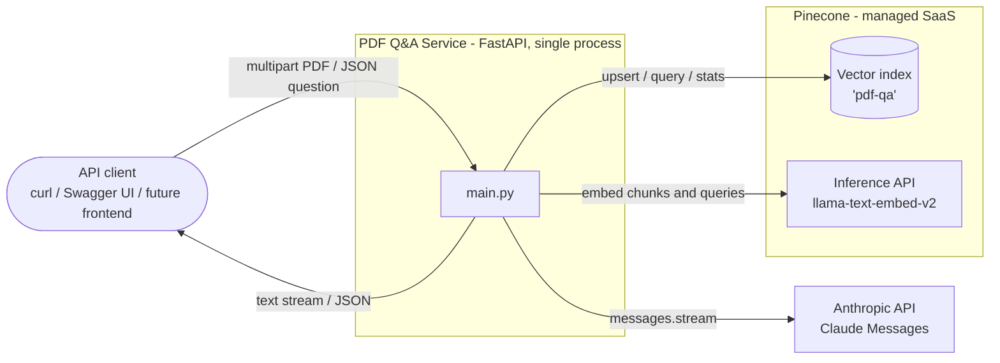
```mermaid
flowchart LR
    user([API client<br/>curl / Swagger UI / future frontend])

    subgraph svc [PDF Q&A Service - FastAPI, single process]
        api[main.py]
    end

    subgraph pinecone [Pinecone - managed SaaS]
        idx[(Vector index<br/>'pdf-qa')]
        inf[Inference API<br/>llama-text-embed-v2]
    end

    claude[Anthropic API<br/>Claude Messages]

    user -- "multipart PDF / JSON question" --> api
    api -- "text stream / JSON" --> user
    api -- "embed chunks and queries" --> inf
    api -- "upsert / query / stats" --> idx
    api -- "messages.stream" --> claude
```

**Key point:** the service only coordinates. All the heavy work (embedding, similarity search, generation) happens in two external services. That makes the service simple and cheap to host, but **its availability and latency are limited by Pinecone's and Anthropic's** (see [§9](#9-quality-attributes)).

---

## 3. Components and Responsibilities

Everything lives in `main.py`, but it has distinct logical components:

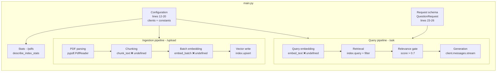
```mermaid
flowchart TB
    subgraph mainpy [main.py]
        direction TB
        cfg["Configuration<br/>lines 12-20<br/>clients + constants"]
        model["Request schema<br/>QuestionRequest<br/>lines 23-26"]

        subgraph ingest [Ingestion pipeline - /upload]
            parse["PDF parsing<br/>pypdf.PdfReader"]
            chunk["Chunking<br/>chunk_text ❌ undefined"]
            embedB["Batch embedding<br/>embed_batch ❌ undefined"]
            store["Vector write<br/>index.upsert"]
        end

        subgraph qa [Query pipeline - /ask]
            embedQ["Query embedding<br/>embed_text ❌ undefined"]
            retrieve["Retrieval<br/>index.query + filter"]
            gate["Relevance gate<br/>score > 0.7"]
            gen["Generation<br/>client.messages.stream"]
        end

        stats["Stats - /pdfs<br/>describe_index_stats"]
    end

    cfg --> ingest
    cfg --> qa
    cfg --> stats
    model --> qa
    parse --> chunk --> embedB --> store
    embedQ --> retrieve --> gate --> gen
```

| Component | Lines | Responsibility | Coupling notes |
|---|---|---|---|
| Configuration | `main.py:12-20` | Creates the three clients and sets constants | Runs **when the module is imported**, which makes it hard to test or swap |
| Request schema | `main.py:23-26` | Validates `/ask` input | No limits on `top_k` or `question` length |
| Ingestion | `main.py:29-92` | PDF → text → chunks → vectors → Pinecone | One synchronous request; cost and time grow with PDF size |
| Query | `main.py:95-141` | Question → vector → top-k → Claude → stream | Two response formats (JSON or plain text) |
| Stats | `main.py:144-154` | Total vector count | The name and docstring promise a list of PDFs it doesn't return |

---

## 4. Startup Sequence

`uvicorn main:app` **imports** `main.py`, which runs all its top-level code. Startup therefore depends on credentials **and** on network access to Pinecone.

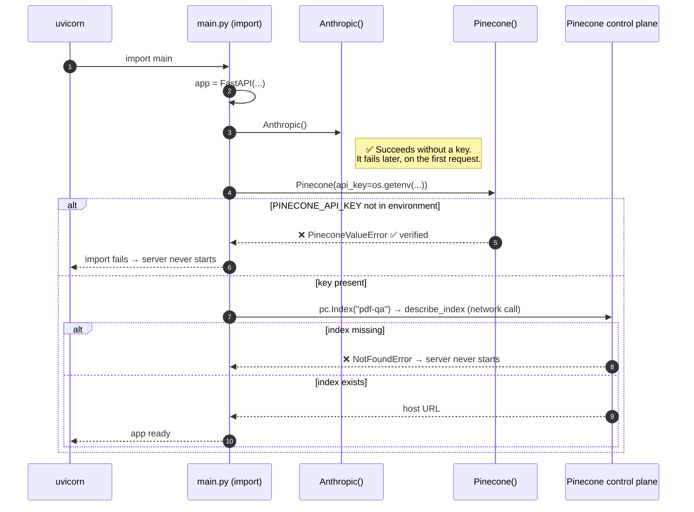
```mermaid
sequenceDiagram
    autonumber
    participant U as uvicorn
    participant M as main.py (import)
    participant A as Anthropic()
    participant P as Pinecone()
    participant PC as Pinecone control plane

    U->>M: import main
    M->>M: app = FastAPI(...)
    M->>A: Anthropic()
    Note right of A: ✅ Succeeds without a key.<br/>It fails later, on the first request.
    M->>P: Pinecone(api_key=os.getenv(...))
    alt PINECONE_API_KEY not in environment
        P-->>M: ❌ PineconeValueError ✅ verified
        M-->>U: import fails → server never starts
    else key present
        M->>PC: pc.Index("pdf-qa") → describe_index (network call)
        alt index missing
            PC-->>M: ❌ NotFoundError → server never starts
        else index exists
            PC-->>M: host URL
            M-->>U: app ready
        end
    end
```

**Why the key is "not in the environment":** `.env` has the right keys, and `python-dotenv` is installed, but **nothing calls `load_dotenv()`**. Two possible fixes:
- Add `from dotenv import load_dotenv; load_dotenv()` at the top of `main.py`, **or**
- Start with `uv run --env-file .env uvicorn main:app --reload`.

**Architectural note:** creating clients at import time ties "the module loads" to "the external services are reachable". A FastAPI **lifespan** handler, or lazy dependency injection, would let the app start, report health honestly, and swap in fakes for tests.

---

## 5. Upload Flow (`POST /upload`)

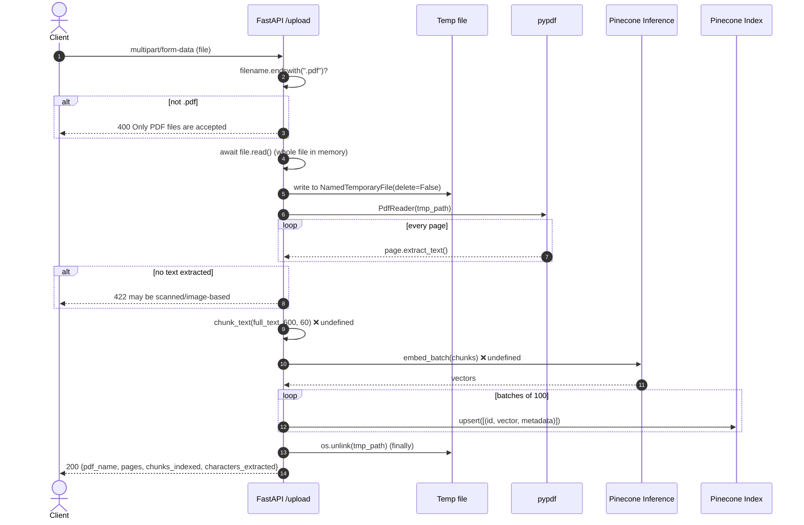
```mermaid
sequenceDiagram
    autonumber
    actor C as Client
    participant API as FastAPI /upload
    participant FS as Temp file
    participant PDF as pypdf
    participant EMB as Pinecone Inference
    participant VDB as Pinecone Index

    C->>API: multipart/form-data (file)
    API->>API: filename.endswith(".pdf")?
    alt not .pdf
        API-->>C: 400 Only PDF files are accepted
    end
    API->>API: await file.read() (whole file in memory)
    API->>FS: write to NamedTemporaryFile(delete=False)
    API->>PDF: PdfReader(tmp_path)
    loop every page
        PDF-->>API: page.extract_text()
    end
    alt no text extracted
        API-->>C: 422 may be scanned/image-based
    end
    API->>API: chunk_text(full_text, 600, 60) ❌ undefined
    API->>EMB: embed_batch(chunks) ❌ undefined
    EMB-->>API: vectors
    loop batches of 100
        API->>VDB: upsert([(id, vector, metadata)])
    end
    API->>FS: os.unlink(tmp_path) (finally)
    API-->>C: 200 {pdf_name, pages, chunks_indexed, characters_extracted}
```

**Observations**
- The whole operation is **synchronous inside one HTTP request**. A 300-page PDF could take tens of seconds, and there's no progress reporting and no way to resume.
- **Vector IDs are deterministic** (`{pdf_name}_chunk_{i}`), so re-uploading a file *overwrites* matching IDs (idempotent). But if the new version has **fewer** chunks, the old extra chunks stay behind as **orphans** and still turn up in search.
- The temp file isn't strictly needed: `PdfReader` accepts a file-like object (`io.BytesIO(content)`).

---

## 6. Ask Flow (`POST /ask`)

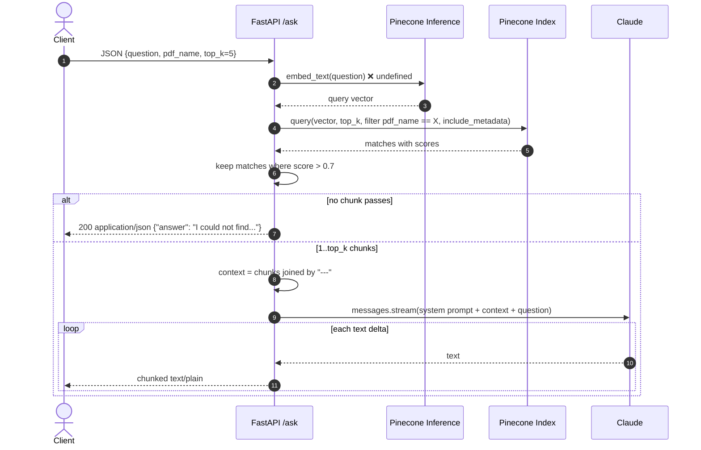
```mermaid
sequenceDiagram
    autonumber
    actor C as Client
    participant API as FastAPI /ask
    participant EMB as Pinecone Inference
    participant VDB as Pinecone Index
    participant LLM as Claude

    C->>API: JSON {question, pdf_name, top_k=5}
    API->>EMB: embed_text(question) ❌ undefined
    EMB-->>API: query vector
    API->>VDB: query(vector, top_k, filter pdf_name == X, include_metadata)
    VDB-->>API: matches with scores
    API->>API: keep matches where score > 0.7
    alt no chunk passes
        API-->>C: 200 application/json {"answer": "I could not find..."}
    else 1..top_k chunks
        API->>API: context = chunks joined by "---"
        API->>LLM: messages.stream(system prompt + context + question)
        loop each text delta
            LLM-->>API: text
            API-->>C: chunked text/plain
        end
    end
```

### Decision logic

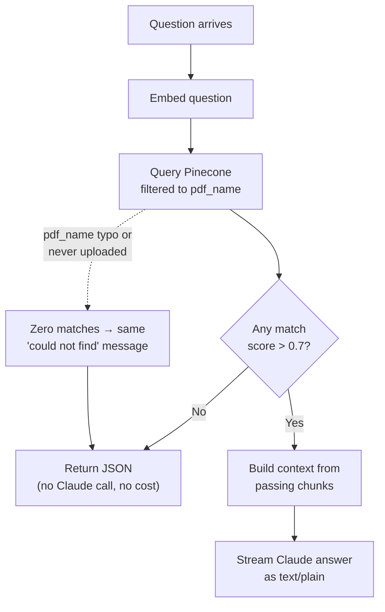
```mermaid
flowchart TD
    A[Question arrives] --> B[Embed question]
    B --> C[Query Pinecone<br/>filtered to pdf_name]
    C --> D{"Any match<br/>score > 0.7?"}
    D -- No --> E["Return JSON<br/>(no Claude call, no cost)"]
    D -- Yes --> F[Build context from<br/>passing chunks]
    F --> G[Stream Claude answer<br/>as text/plain]
    C -.pdf_name typo or<br/>never uploaded.-> H[Zero matches → same<br/>'could not find' message]
    H --> E
```

**Observations**
- **Two response formats:** clients must check `Content-Type` to tell the "no answer" JSON apart from a streamed plain-text answer. A single format (for example Server-Sent Events with typed events, or always JSON with a `stream` flag) would be easier to consume.
- **An unknown `pdf_name` is indistinguishable from an irrelevant question.** Both get the same polite "could not find" message, which hides user errors.
- **The 0.7 cutoff is a magic number.** Score ranges depend on the embedding model and metric, so it has to be tuned for `llama-text-embed-v2`.
- **Errors mid-stream:** once streaming starts, the HTTP status is already 200. If Claude fails partway through, the client receives a cut-off answer with no error signal.
- **Synchronous calls inside `async def`:** `embed_text` and `index.query` block the event loop, so other requests wait while they run. The generator *is* safe: Starlette runs synchronous generators in a thread pool.

---

## 7. Data Model

The only persistent data lives in the Pinecone index. Each vector record looks like this:

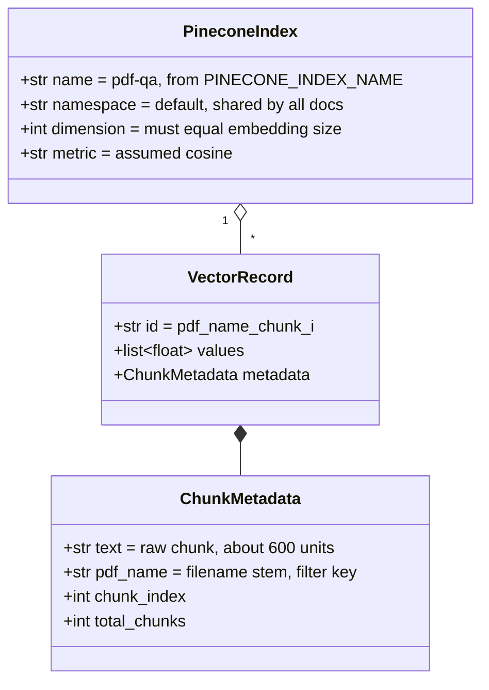
```mermaid
classDiagram
    class PineconeIndex {
        +str name = pdf-qa, from PINECONE_INDEX_NAME
        +str namespace = default, shared by all docs
        +int dimension = must equal embedding size
        +str metric = assumed cosine
    }
    class VectorRecord {
        +str id = pdf_name_chunk_i
        +list~float~ values
        +ChunkMetadata metadata
    }
    class ChunkMetadata {
        +str text = raw chunk, about 600 units
        +str pdf_name = filename stem, filter key
        +int chunk_index
        +int total_chunks
    }
    PineconeIndex "1" o-- "*" VectorRecord
    VectorRecord *-- ChunkMetadata
```

A logical (implicit) view of the entities:

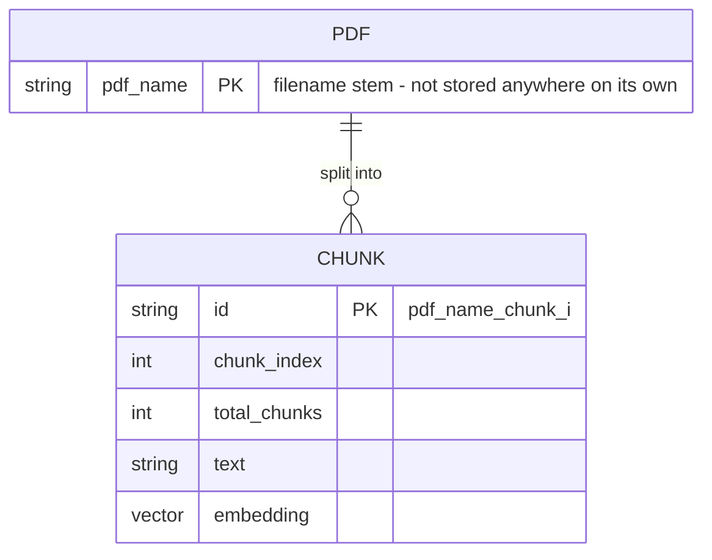
```mermaid
erDiagram
    PDF ||--o{ CHUNK : "split into"
    PDF {
        string pdf_name PK "filename stem - not stored anywhere on its own"
    }
    CHUNK {
        string id PK "pdf_name_chunk_i"
        int chunk_index
        int total_chunks
        string text
        vector embedding
    }
```

**Implications**
- **A "PDF" only exists as a value repeated across its chunks.** There's no PDF registry, which is why `/pdfs` can't list them. Listing would need a separate store (a small database table) or a metadata scan.
- **Identity is weak:** `Report.pdf` from two users, or two folders, collide on `pdf_name = "Report"`.
- **One shared namespace:** every document lives in the default namespace and is separated only by a metadata filter. Pinecone **namespaces** per tenant or per document would give stronger isolation and simpler deletes.
- **Metadata size:** Pinecone limits metadata per vector (currently 40 KB). 600-character chunks are well under that, but this matters if the chunk size grows a lot.

---

## 8. Where State Lives

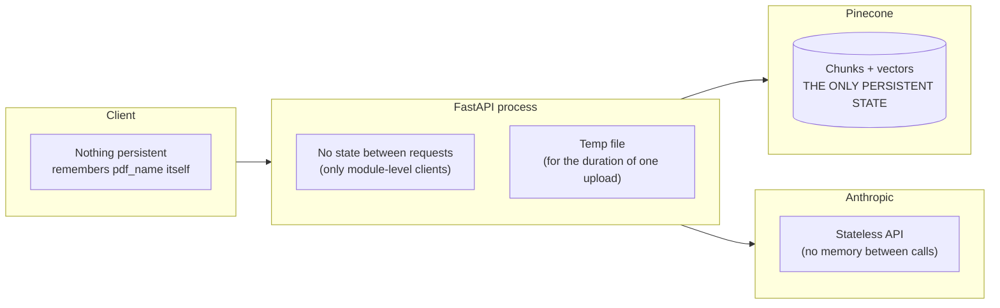
```mermaid
flowchart LR
    subgraph client [Client]
        cs["Nothing persistent<br/>remembers pdf_name itself"]
    end
    subgraph server [FastAPI process]
        ss["No state between requests<br/>(only module-level clients)"]
        tmp["Temp file<br/>(for the duration of one upload)"]
    end
    subgraph pc [Pinecone]
        vs[("Chunks + vectors<br/>THE ONLY PERSISTENT STATE")]
    end
    subgraph an [Anthropic]
        as["Stateless API<br/>(no memory between calls)"]
    end
    client --> server --> pc
    server --> an
```

| State | Where | Lifetime |
|---|---|---|
| Indexed documents | Pinecone | Until deleted (there's no delete endpoint) |
| Uploaded file bytes | Temp file | One request |
| Which PDF the user is "in" | The client (sends `pdf_name` each time) | Up to the client |
| Conversation | **Nowhere.** Each `/ask` is independent | — |
| Users, sessions, auth | Nowhere | — |

Because the server holds no state, it can be **scaled horizontally for free**: any number of uvicorn workers or replicas behave the same. Conversation history is the first feature that threatens that property.

---

## 9. Quality Attributes

| Attribute | Current assessment | Notes |
|---|---|---|
| **Correctness** | 🔴 | Undefined helpers; untuned relevance cutoff |
| **Availability** | 🟠 | Startup needs Pinecone to be reachable; no retries around Pinecone; no health endpoint |
| **Latency** | 🟡 | `/ask` makes 3 sequential network calls (embed → query → generate); streaming hides the generation time |
| **Throughput** | 🟠 | Synchronous calls inside `async def` block the event loop; a slow upload stalls every other request |
| **Scalability** | 🟢 / 🟠 | Stateless, so it scales out easily; ingestion doesn't scale (runs inside the request, no queue) |
| **Security** | 🔴 | No authentication, no rate limits, unlimited upload size, filename used as an ID, any user can query any document |
| **Cost control** | 🔴 | Anyone can trigger paid embedding and Claude calls without limit |
| **Observability** | 🔴 | No logging, metrics, request IDs or token-usage tracking |
| **Testability** | 🔴 | Clients created at import time; no seams for injecting fakes |
| **Maintainability** | 🟡 | Small and readable; everything in one file is fine at this size |

### Security threat sketch

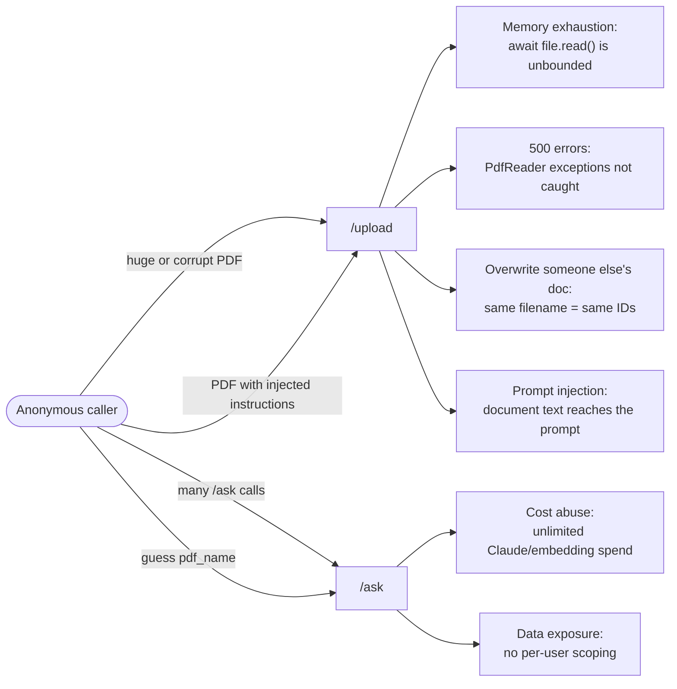
```mermaid
flowchart LR
    attacker([Anonymous caller]) -->|"huge or corrupt PDF"| up["/upload"]
    attacker -->|"many /ask calls"| ask["/ask"]
    attacker -->|"guess pdf_name"| ask
    attacker -->|"PDF with injected instructions"| up

    up --> r1["Memory exhaustion:<br/>await file.read() is unbounded"]
    up --> r2["500 errors:<br/>PdfReader exceptions not caught"]
    up --> r5["Overwrite someone else's doc:<br/>same filename = same IDs"]
    ask --> r3["Cost abuse:<br/>unlimited Claude/embedding spend"]
    ask --> r4["Data exposure:<br/>no per-user scoping"]
    up --> r6["Prompt injection:<br/>document text reaches the prompt"]
```

---

## 10. Key Design Decisions and Trade-offs

Written as lightweight ADRs (architecture decision records), with the reasoning inferred from the code.

| # | Decision | Benefit | Cost / risk | Verdict |
|---|---|---|---|---|
| D1 | **Managed vector DB (Pinecone)** | No infrastructure to run; filtering; scales | Vendor lock-in; network hop; paid | ✅ Good for a prototype |
| D2 | **Pinecone-hosted embeddings (`llama-text-embed-v2`)** | One vendor and one key for vectors and embeddings | Index dimension must match; embedding provider is tied to the vector DB | ✅ Good choice; earlier code referenced Voyage, which had no client installed |
| D3 | **Fixed-size chunking with overlap (600 / 60)** | Simple, predictable | Splits mid-sentence and mid-table; units (characters or tokens?) undefined | 🟡 Fine to start; consider sentence- or heading-aware splitting later |
| D4 | **Filter by `pdf_name` metadata, not namespaces** | One namespace, simple queries | Weak isolation; deleting a document needs a filter-based delete | 🟡 Revisit when adding users |
| D5 | **Hard relevance gate (`score > 0.7`)** | Saves money; reduces made-up answers | False negatives; model-specific | 🟡 Make it configurable and tune it with an eval set |
| D6 | **Stream plain text** | Simple; fast first token | Inconsistent with the JSON error path; no metadata such as sources or usage | 🟠 Switch to SSE with typed events |
| D7 | **Single file, clients at module level** | Minimal ceremony | Not testable; import-time side effects | 🟠 Split into modules plus dependency injection once the feature set grows |
| D8 | **Synchronous ingestion inside the request** | No queue infrastructure | Timeouts on big PDFs; no progress reporting | 🟠 Move to a background task or worker for large files |

---

## 11. Designing Conversation History

Today every `/ask` is independent. Supporting follow-ups like *"what about the second one?"* touches four areas: **the API contract, storage, retrieval, and prompt assembly.**

### 11.1 Option A — The client sends the history (stateless)

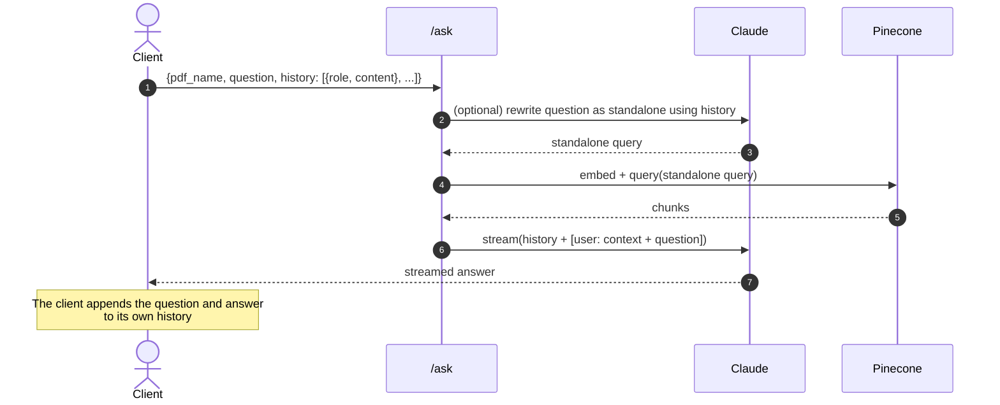
```mermaid
sequenceDiagram
    autonumber
    actor C as Client
    participant API as /ask
    participant LLM as Claude
    participant VDB as Pinecone

    C->>API: {pdf_name, question, history: [{role, content}, ...]}
    API->>LLM: (optional) rewrite question as standalone using history
    LLM-->>API: standalone query
    API->>VDB: embed + query(standalone query)
    VDB-->>API: chunks
    API->>LLM: stream(history + [user: context + question])
    LLM-->>C: streamed answer
    Note over C: The client appends the question and answer<br/>to its own history
```

- ✅ No database; keeps the server stateless and horizontally scalable
- ✅ Trivial to implement: one new field on `QuestionRequest`
- ❌ The client can fake or tamper with history; history is lost when the page reloads (unless the client persists it)
- ❌ The payload grows with each turn

### 11.2 Option B — The server stores conversations

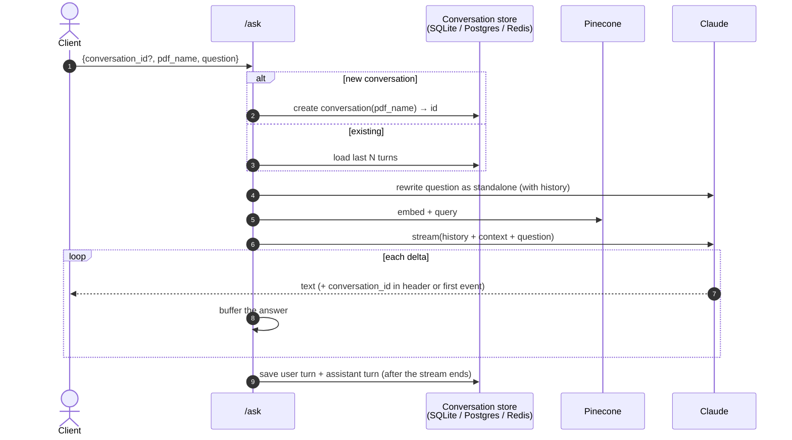
```mermaid
sequenceDiagram
    autonumber
    actor C as Client
    participant API as /ask
    participant DB as Conversation store<br/>(SQLite / Postgres / Redis)
    participant VDB as Pinecone
    participant LLM as Claude

    C->>API: {conversation_id?, pdf_name, question}
    alt new conversation
        API->>DB: create conversation(pdf_name) → id
    else existing
        API->>DB: load last N turns
    end
    API->>LLM: rewrite question as standalone (with history)
    API->>VDB: embed + query
    API->>LLM: stream(history + context + question)
    loop each delta
        LLM-->>C: text (+ conversation_id in header or first event)
        API->>API: buffer the answer
    end
    API->>DB: save user turn + assistant turn (after the stream ends)
```

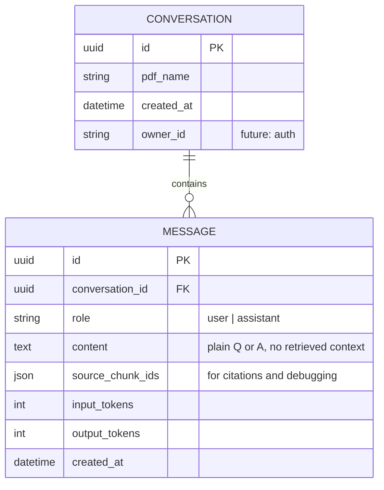
```mermaid
erDiagram
    CONVERSATION ||--o{ MESSAGE : contains
    CONVERSATION {
        uuid id PK
        string pdf_name
        datetime created_at
        string owner_id "future: auth"
    }
    MESSAGE {
        uuid id PK
        uuid conversation_id FK
        string role "user | assistant"
        text content "plain Q or A, no retrieved context"
        json source_chunk_ids "for citations and debugging"
        int input_tokens
        int output_tokens
        datetime created_at
    }
```

- ✅ History survives reloads and devices; can be audited; enables analytics
- ❌ Needs a database; must handle client disconnects mid-stream (save partial answers or nothing?)
- ⚠️ **Don't** use an in-memory `dict`: it's lost on every `--reload` restart and isn't shared between workers

### 11.3 Cross-cutting design rules (either option)

1. **Store only the plain question and answer in history.** Attach retrieved chunks to the **latest** user turn only. Otherwise every past turn re-sends its context and token use grows quadratically.
2. **Rewrite the follow-up question before retrieval.** Embedding "what about the second one?" retrieves nothing useful. A cheap Claude call (e.g. `claude-haiku-4-5`) turns it into a standalone query first.
3. **Rethink the relevance gate.** A follow-up such as "summarize what you just said" needs **no** retrieval. The early return at `main.py:116-119` would block it today.
4. **Limit history.** Keep the last N turns or a token budget, and tie each conversation to exactly one `pdf_name`.
5. **Prompt caching.** With a stable system prompt and an append-only history, add `cache_control` so repeated prefixes are billed at roughly 10%.

**Recommendation:** start with **Option A** to get the multi-turn prompt and question rewriting right with nothing else to manage. Move to **Option B** (SQLite first) once you need persistence or analytics. The `/ask` internals barely change between the two; only where the history comes from changes.

---

## 12. Proposed Target Architecture

A realistic next step, not an enterprise rewrite:

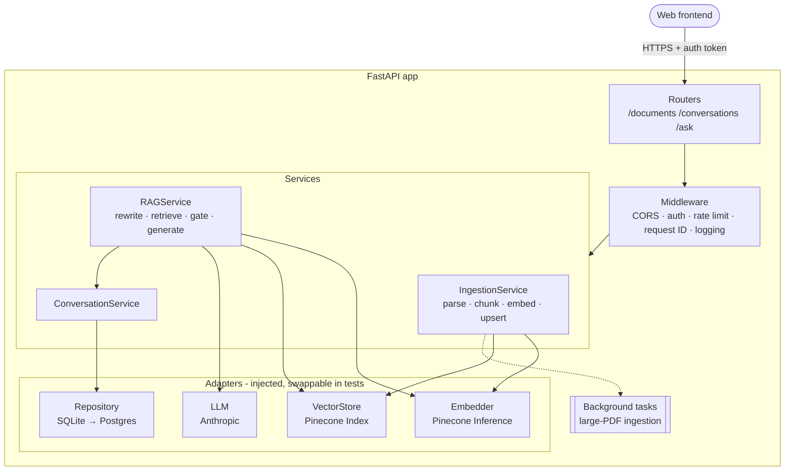
```mermaid
flowchart TB
    fe([Web frontend]) -->|HTTPS + auth token| gw

    subgraph app [FastAPI app]
        gw[Routers<br/>/documents /conversations /ask]
        mw[Middleware<br/>CORS · auth · rate limit · request ID · logging]
        subgraph services [Services]
            ing[IngestionService<br/>parse · chunk · embed · upsert]
            rag[RAGService<br/>rewrite · retrieve · gate · generate]
            conv[ConversationService]
        end
        subgraph adapters [Adapters - injected, swappable in tests]
            emb[Embedder<br/>Pinecone Inference]
            vs[VectorStore<br/>Pinecone Index]
            llm[LLM<br/>Anthropic]
            repo[Repository<br/>SQLite → Postgres]
        end
        bg[[Background tasks<br/>large-PDF ingestion]]
    end

    gw --> mw --> services
    ing --> emb & vs
    ing -.-> bg
    rag --> emb & vs & llm
    conv --> repo
    rag --> conv
```

---

# Part II — Developer View

## 13. Local Setup Runbook

```bash
# 0. Make sure no other project's venv is active (see §21)
deactivate 2>/dev/null; unset VIRTUAL_ENV

# 1. Install dependencies into ./.venv from uv.lock
uv sync

# 2. Fill in .env (ANTHROPIC_API_KEY, PINECONE_API_KEY, PINECONE_INDEX_NAME)

# 3. Create the Pinecone index once, with a dimension matching the embedding model
#    llama-text-embed-v2 defaults to 1024 dims; metric: cosine (verify in Pinecone docs/console)

# 4. Run (loads .env without code changes)
uv run --env-file .env uvicorn main:app --reload

# 5. Explore
open http://127.0.0.1:8000/docs
```

Smoke tests (once the helpers exist):

```bash
curl -F "file=@sample.pdf" http://127.0.0.1:8000/upload
curl -N -X POST http://127.0.0.1:8000/ask \
  -H 'Content-Type: application/json' \
  -d '{"pdf_name":"sample","question":"What is this document about?"}'
```

`-N` turns off curl's buffering so you can watch tokens stream in.

---

## 14. Configuration Reference

| Name | Kind | Default | Used at | Notes |
|---|---|---|---|---|
| `ANTHROPIC_API_KEY` | env | — | `main.py:13` (implicitly) | `Anthropic()` doesn't fail without it ✅. The first `/ask` does |
| `PINECONE_API_KEY` | env | — | `main.py:14` | Missing → import fails ✅ |
| `PINECONE_INDEX_NAME` | env | `"pdf-qa"` | `main.py:15` | Index must already exist, or import fails with `NotFoundError` |
| `EMBEDDING_MODEL` | const | `"llama-text-embed-v2"` | not yet referenced | For use in the missing helpers |
| `GENERATION_MODEL` | const | `"claude-sonnet-4-20250514"` | `main.py:125` | Deprecated (see §17) |
| `CHUNK_SIZE` | const | `600` | `main.py:60` | Units depend on the `chunk_text` implementation |
| `CHUNK_OVERLAP` | const | `60` | `main.py:60` | 10% overlap |
| relevance cutoff | literal | `0.7` | `main.py:113` | Should become a named, configurable constant |
| `max_tokens` | literal | `1024` | `main.py:126` | May cut off long answers |
| `temperature` | literal | `0.1` | `main.py:127` | **Rejected by Sonnet 5.5** (non-default values return a 400) |

**Suggestion:** move these into a `pydantic-settings` `Settings` class. It's validated at startup, loads `.env` natively, and makes everything overridable in tests.

---

## 15. API Reference

### `POST /upload`

| | |
|---|---|
| Request | `multipart/form-data`, field `file` |
| 200 | `{"pdf_name": str, "pages": int, "chunks_indexed": int, "characters_extracted": int}` |
| 400 | Filename doesn't end in `.pdf` (case-sensitive: `.PDF` is rejected) |
| 422 | No text could be extracted (scanned or image-only PDF) |
| 500 | Corrupt PDF (uncaught `pypdf` error), Pinecone or embedding failure, **currently always (`NameError`)** |

### `POST /ask`

| | |
|---|---|
| Request | `application/json` `{"question": str, "pdf_name": str, "top_k": int = 5}` |
| 200 (no match) | `application/json` `{"answer": "I could not find relevant sections..."}` |
| 200 (match) | `text/plain`, chunked stream of answer text |
| 422 | Pydantic validation error (missing or mistyped fields) |
| 500 | **Currently always (`NameError` in `embed_text`)** |

### `GET /pdfs`

| | |
|---|---|
| 200 | `{"total_chunks": int, "note": "Use Pinecone console..."}` |

Despite its name and docstring, it **doesn't list PDFs**. It's a plain sync `def`, so FastAPI runs it in a thread pool, which is correct for a blocking call.

---

## 16. Code Walkthrough

| Lines | What happens | Comments |
|---|---|---|
| 1-10 | Imports | `python-dotenv` installed but never imported |
| 12 | `app = FastAPI(...)` | The ASGI app that `uvicorn main:app` points to |
| 13 | `client = Anthropic()` | Synchronous client used from a sync generator: OK |
| 14-15 | Pinecone client + `pc.Index(name)` | `pc.Index` is kept for compatibility in pinecone 10; the new style is `pc.index(name=...)`. It makes a network call at import ✅ |
| 17-20 | Constants | `EMBEDDING_MODEL` is not used yet |
| 23-26 | `QuestionRequest` | Consider `Field(min_length=1, max_length=2000)` and `top_k: int = Field(5, ge=1, le=20)` |
| 35 | Extension check | `file.filename` can be `None` → `AttributeError`; use `.lower().endswith(".pdf")` and/or check the `%PDF-` magic bytes |
| 39-42 | Write temp file | `delete=False` + `unlink` in `finally` is correct; `io.BytesIO` would avoid touching disk |
| 46-51 | Text extraction | String `+=` in a loop is fine at this scale; `"\n".join(...)` is idiomatic |
| 60 | `chunk_text(...)` | ❌ **undefined** |
| 63 | `embed_batch([c for c in chunks])` | ❌ **undefined**; `[c for c in chunks]` is just `chunks` |
| 66 | `pdf_name = Path(filename).stem` | Collisions across users and folders |
| 81-82 | Manual batches of 100 | pinecone 10 `upsert` accepts `batch_size=` ✅; also shows a progress bar by default (`show_progress=True`) |
| 102 | `embed_text(...)` | ❌ **undefined** |
| 105-110 | Filtered query | Correct `$eq` filter syntax |
| 113 | `score > 0.7` | Magic number |
| 116-119 | Early return as JSON | Different content type from the success path |
| 123-139 | Streaming generator | Sync generator → Starlette thread pool ✅; no error handling inside the stream |
| 128-130 | System prompt | Reasonable; consider asking for citations by chunk index and instructing the model to ignore instructions inside documents |
| 150 | `describe_index_stats()` | Response has `total_vector_count` ✅ and `namespaces` |

---

## 17. Known Defects

Ordered by severity. "✅" means reproduced or verified against installed packages.

| # | Severity | Defect | Location | Fix |
|---|---|---|---|---|
| 1 | 🔴 Blocker | `chunk_text` undefined | `main.py:60` | Implement (see §18) |
| 2 | 🔴 Blocker | `embed_batch` undefined | `main.py:63` | Implement with `pc.inference.embed` ✅ (method exists in pinecone 10) |
| 3 | 🔴 Blocker | `embed_text` undefined | `main.py:102` | Same, with `input_type="query"` |
| 4 | 🔴 Blocker | `.env` never loaded → `PineconeValueError` at import ✅ | `main.py:14` | `load_dotenv()` or `uv run --env-file .env` |
| 5 | 🟠 High | Deprecated model `claude-sonnet-4-20250514` | `main.py:18` | Use `claude-sonnet-5-5` **and remove `temperature=0.1`** (non-default sampling values return a 400 on Sonnet 5.5) |
| 6 | 🟠 High | Index dimension must match `llama-text-embed-v2` output | Pinecone config | Create the index with the matching dimension |
| 7 | 🟠 High | Blocking I/O inside `async def` endpoints | `main.py:30, 96` | Make them plain `def`, or wrap calls with `run_in_threadpool` |
| 8 | 🟠 High | No upload size limit | `main.py:40` | Reject above N MB (check `Content-Length` plus read limit) |
| 9 | 🟡 Medium | Orphan chunks when a PDF is re-uploaded with fewer chunks | `main.py:69` | Delete by `pdf_name` filter before upserting, or use a namespace per document |
| 10 | 🟡 Medium | Uncaught `pypdf` errors → 500 | `main.py:46` | Catch `pypdf.errors.PdfReadError` → 422 |
| 11 | 🟡 Medium | `/ask` has two response formats | `main.py:117, 141` | Use one format (SSE) |
| 12 | 🟡 Medium | Errors after streaming starts are invisible | `main.py:123-139` | Send an error event or marker in the stream |
| 13 | 🟡 Medium | `file.filename` may be `None`; `.PDF` rejected | `main.py:35` | Normalize and guard |
| 14 | 🟢 Low | `/pdfs` doesn't list PDFs | `main.py:144-154` | Rename, or add a document registry |
| 15 | 🟢 Low | Unbounded `top_k` | `main.py:26` | `Field(ge=1, le=20)` |
| 16 | 🟢 Low | `max_tokens=1024` may cut off answers | `main.py:126` | Raise it and check `stop_reason` |
| 17 | 🟢 Low | Stray `main.cpython-312.pyc` | `__pycache__/` | Delete; it's already git-ignored |

---

## 18. Implementing the Missing Helpers

A reference sketch, **not applied to `main.py`**. The `pc.inference.embed(model, inputs, parameters)` signature was checked against the installed pinecone 10.0.0 ✅. Look up the exact `parameters` keys in Pinecone's docs for `llama-text-embed-v2`.

```python
def chunk_text(text: str, size: int, overlap: int) -> list[str]:
    """Fixed-size character windows with overlap."""
    if overlap >= size:
        raise ValueError("overlap must be smaller than size")
    step = size - overlap
    return [text[i : i + size] for i in range(0, len(text), step) if text[i : i + size].strip()]


def _embed(inputs: list[str], input_type: str) -> list[list[float]]:
    result = pc.inference.embed(
        model=EMBEDDING_MODEL,
        inputs=inputs,
        parameters={"input_type": input_type, "truncate": "END"},
    )
    return [e.values for e in result]  # verify attribute name against EmbeddingsList


def embed_batch(chunks: list[str], batch_size: int = 96) -> list[list[float]]:
    # Hosted embedding endpoints cap inputs per request, so send them in batches
    out: list[list[float]] = []
    for i in range(0, len(chunks), batch_size):
        out.extend(_embed(chunks[i : i + batch_size], "passage"))
    return out


def embed_text(text: str) -> list[float]:
    return _embed([text], "query")[0]
```

**Why `input_type` matters:** asymmetric retrieval models embed *passages* (documents) and *queries* (questions) differently. Using the wrong type on either side quietly lowers retrieval quality, and so the scores that the 0.7 cutoff depends on.

### Chunking pipeline at a glance

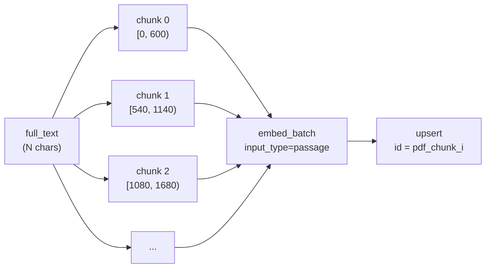
```mermaid
flowchart LR
    T["full_text<br/>(N chars)"] --> W1["chunk 0<br/>[0, 600)"]
    T --> W2["chunk 1<br/>[540, 1140)"]
    T --> W3["chunk 2<br/>[1080, 1680)"]
    T --> Wn["..."]
    W1 & W2 & W3 & Wn --> E["embed_batch<br/>input_type=passage"]
    E --> U["upsert<br/>id = pdf_chunk_i"]
```

---

## 19. Dependencies

Locked in `uv.lock` ✅:

| Package | Locked | Role | Notes |
|---|---|---|---|
| `anthropic` | 1.11.0 | Claude client | 1.x uses `httpx2` internally |
| `fastapi` | 0.142.2 | Web framework | |
| `starlette` | 1.7.0 | ASGI toolkit (via FastAPI) | |
| `pinecone` | 10.0.0 | Vector DB + inference client | Replaced the deprecated `pinecone-client` (6.0.0 raised an error on import ✅) |
| `pypdf` | 6.19.0 | PDF text extraction | No OCR: scanned PDFs → 422 |
| `python-dotenv` | 1.2.4 | `.env` loader | **Installed, never used** |
| `uvicorn` | 0.54.0 | ASGI server | No `[standard]` extra (no `uvloop`/`httptools`; fine for dev) |
| `pydantic` | 2.13.5 | Validation (via FastAPI) | |

**Missing for production:** `pydantic-settings`, a test stack (`pytest`, `httpx` for `TestClient`), a linter/formatter (`ruff`), and structured logging.

**Python version:** `.python-version` = 3.13 and `requires-python >= 3.13`; the venv is 3.13 ✅.

---

## 20. Testing Strategy

There are no tests yet. A pragmatic pyramid for this service:

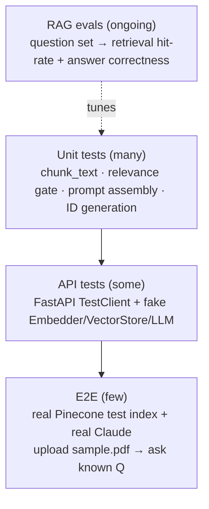
```mermaid
flowchart TB
    e2e["E2E (few)<br/>real Pinecone test index + real Claude<br/>upload sample.pdf → ask known Q"]
    integ["API tests (some)<br/>FastAPI TestClient + fake Embedder/VectorStore/LLM"]
    unit["Unit tests (many)<br/>chunk_text · relevance gate · prompt assembly · ID generation"]
    evals["RAG evals (ongoing)<br/>question set → retrieval hit-rate + answer correctness"]
    unit --> integ --> e2e
    evals -.tunes.-> unit
```

| Layer | Examples |
|---|---|
| Unit | `chunk_text` covers all text; overlap correct; `overlap >= size` raises; empty text → `[]` |
| API | Non-PDF → 400; empty-text PDF → 422; no matches → JSON body; matches → streamed text; `top_k` bounds |
| E2E | Upload a fixture PDF, ask 3 questions with known answers |
| Evals | 20-50 Q&A pairs per sample doc; track retrieval recall@k and answer accuracy when changing chunk size, cutoff, or model |

**Prerequisite:** move client creation out of import time (dependency injection or a FastAPI lifespan) so tests can substitute fakes without network access or API keys.

---

## 21. Development Environment Gotchas

Things that already came up on this machine:

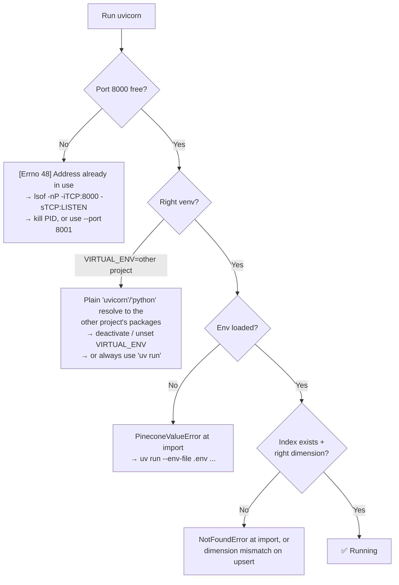
```mermaid
flowchart TD
    A[Run uvicorn] --> B{Port 8000 free?}
    B -- No --> C["[Errno 48] Address already in use<br/>→ lsof -nP -iTCP:8000 -sTCP:LISTEN<br/>→ kill PID, or use --port 8001"]
    B -- Yes --> D{Right venv?}
    D -- "VIRTUAL_ENV=other project" --> E["Plain 'uvicorn'/'python' resolve to the<br/>other project's packages<br/>→ deactivate / unset VIRTUAL_ENV<br/>→ or always use 'uv run'"]
    D -- Yes --> F{Env loaded?}
    F -- No --> G["PineconeValueError at import<br/>→ uv run --env-file .env ..."]
    F -- Yes --> H{Index exists +<br/>right dimension?}
    H -- No --> I["NotFoundError at import, or<br/>dimension mismatch on upsert"]
    H -- Yes --> J[✅ Running]
```

- **Leftover orphan servers:** `--reload` and `fastapi dev` start a watcher process plus a worker process. Closing a terminal doesn't always stop them.
- **`uv run` vs bare commands:** `uv` ignores an activated venv that belongs to another project (it prints a warning). `PATH`-based commands don't, so `uv run` is the safe default.
- **`main.cpython-312.pyc`** shows the file was once imported by a Python 3.12 interpreter (another project's venv), while this project uses 3.13.

---

# Part III — Product Manager View

## 22. Product Summary

**One-liner:** *"Ask questions about your PDF and get answers based only on its contents, streamed in real time."*

**Value proposition:** long documents (contracts, manuals, research papers, policies) are slow to search manually and risky to summarize with a general chatbot that may make things up. This service limits answers to the document's own text and says when the answer isn't there.

**Positioning:** at the moment this is an **API building block**, not an end-user product. There's no UI, no accounts and no document management. It's a strong technical foundation for a "chat with your docs" product, or for an internal tool.

---

## 23. Users and Jobs-to-be-Done

| Persona | Job to be done | Served today? |
|---|---|---|
| **Developer / integrator** | "Add document Q&A to my app through an API" | 🟡 Once the blockers are fixed |
| **Knowledge worker** | "Find the clause or figure in this 80-page doc without reading it" | ❌ No UI |
| **Analyst / researcher** | "Ask follow-ups, compare sections, cite sources" | ❌ No history, no citations |
| **Team / organization** | "Share a document library, control who sees what" | ❌ No auth, no multi-tenancy |

---

## 24. Capability Assessment

| Capability | Status | Notes |
|---|---|---|
| Upload a text-based PDF | 🟡 Built, not working | Blocked by missing helpers |
| Scanned / image PDFs | ❌ | Rejected with 422; would need OCR |
| Ask a question about one PDF | 🟡 Built, not working | Blocked by missing helpers |
| Streaming answers | ✅ Designed | Good UX foundation |
| Answers grounded in the document | ✅ Designed | System prompt + relevance gate |
| "Not in document" honesty | ✅ Designed | Two layers: score gate + prompt instruction |
| Follow-up questions (history) | ❌ | See §11 |
| Source citations / page numbers | ❌ | Page numbers aren't captured at extraction |
| List / delete my documents | ❌ | No registry; no delete endpoint |
| Ask across multiple PDFs | ❌ | Filter supports only one `pdf_name` |
| User accounts / privacy | ❌ | Everyone can see everything |
| Usage limits / billing | ❌ | Open cost exposure |
| Web UI | ❌ | Not in the repo |

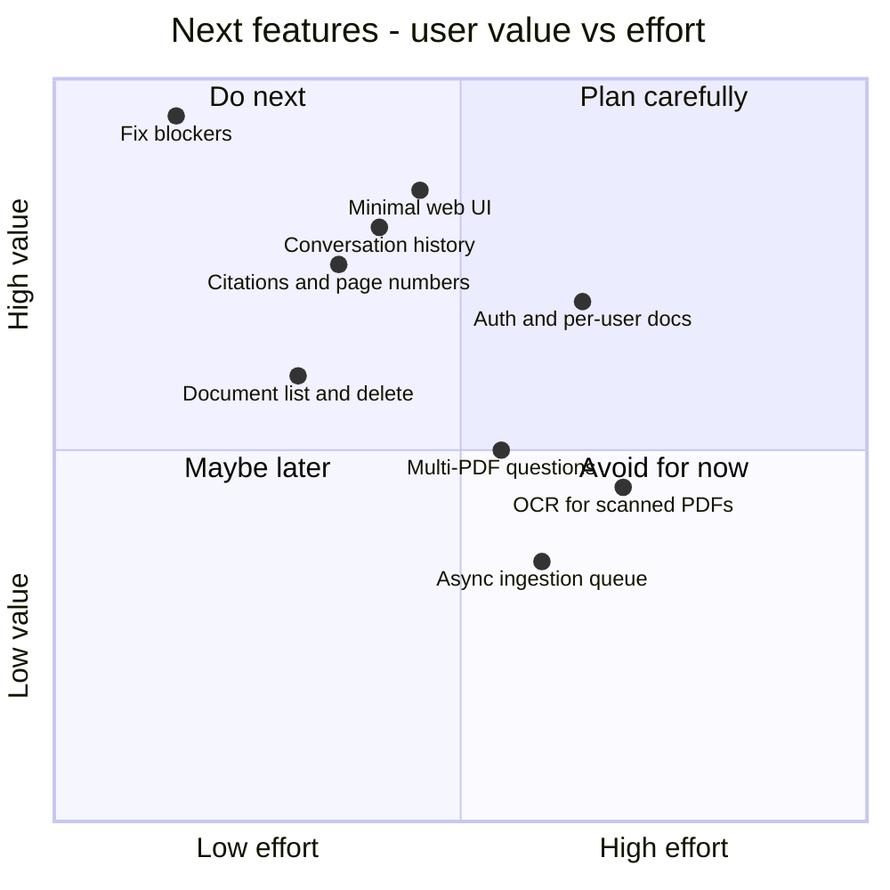
```mermaid
quadrantChart
    title Next features - user value vs effort
    x-axis Low effort --> High effort
    y-axis Low value --> High value
    quadrant-1 Plan carefully
    quadrant-2 Do next
    quadrant-3 Maybe later
    quadrant-4 Avoid for now
    Fix blockers: [0.15, 0.95]
    Conversation history: [0.4, 0.8]
    Citations and page numbers: [0.35, 0.75]
    Document list and delete: [0.3, 0.6]
    Minimal web UI: [0.45, 0.85]
    Auth and per-user docs: [0.65, 0.7]
    OCR for scanned PDFs: [0.7, 0.45]
    Multi-PDF questions: [0.55, 0.5]
    Async ingestion queue: [0.6, 0.35]
```

---

## 25. User Journey

The target journey for an end user once the UI exists, with today's pain points scored low:

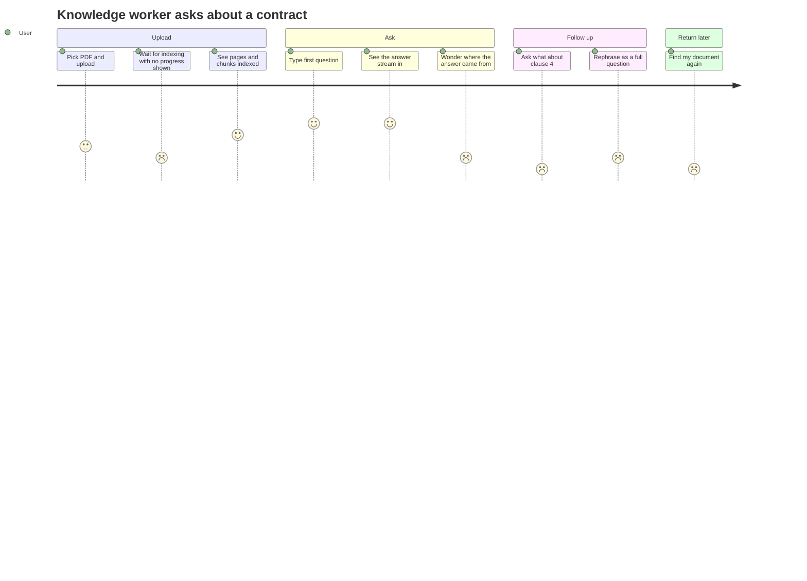
```mermaid
journey
    title Knowledge worker asks about a contract
    section Upload
      Pick PDF and upload: 3: User
      Wait for indexing with no progress shown: 2: User
      See pages and chunks indexed: 4: User
    section Ask
      Type first question: 5: User
      See the answer stream in: 5: User
      Wonder where the answer came from: 2: User
    section Follow up
      Ask what about clause 4: 1: User
      Rephrase as a full question: 2: User
    section Return later
      Find my document again: 1: User
```

The lowest-scoring steps (**follow-ups, finding documents again, trusting sources**) map directly to the top roadmap items.

---

## 26. Risk Register

| # | Risk | Likelihood | Impact | Mitigation |
|---|---|---|---|---|
| R1 | Prototype can't run end to end | Certain (today) | High | Fix the 4 blockers in §17 first |
| R2 | Uncontrolled API spend (open endpoints) | High once deployed | High | Auth + rate limits + per-user quotas before any public URL |
| R3 | Users see each other's documents | High once multi-user | Critical | Per-user namespaces + auth before onboarding real users |
| R4 | Wrong but confident answers | Medium | High | Tune cutoff with evals; citations; "not found" path |
| R5 | Prompt injection via document content | Medium | Medium | System prompt hardening; treat document text as data; no tools available to the model |
| R6 | Deprecated model retired | Medium | High | Migrate to `claude-sonnet-5-5` now |
| R7 | Large PDFs time out | Medium | Medium | Size limits now; background ingestion later |
| R8 | Vendor dependency (Pinecone + Anthropic) | Low | Medium | Adapter layer (§12) keeps them swappable |
| R9 | No version control history or tests | Certain | Medium | First commit now; tests with the helpers |

---

## 27. Roadmap


```mermaid
flowchart LR
    subgraph NOW [Now - make it work]
        n1[Fix 4 blockers]
        n2[First commit + README]
        n3[Migrate model]
        n4[Smoke test with 1 PDF]
    end
    subgraph NEXT [Next - make it useful]
        x1[Conversation history<br/>Option A]
        x2[Citations with page numbers]
        x3[Document list / delete]
        x4[Single SSE response format]
        x5[Minimal web UI + CORS]
    end
    subgraph LATER [Later - make it safe and scalable]
        l1[Auth + per-user namespaces]
        l2[Rate limits / quotas]
        l3[Server-side history<br/>Option B]
        l4[Async ingestion + progress]
        l5[OCR, multi-PDF questions]
        l6[Eval suite + observability]
    end
    NOW --> NEXT --> LATER
```

**Suggested sequencing:** "Now" is about a day of focused work. Ship conversation history **together with** citations: both change the `/ask` contract, so changing it once is cheaper than twice.

---

## 28. Success Metrics

| Category | Metric | Target (initial) |
|---|---|---|
| Quality | Answer accuracy on the eval set | ≥ 85% |
| Quality | Retrieval recall@5 (right chunk in top 5) | ≥ 90% |
| Quality | Correct "not in document" rate on unanswerable questions | ≥ 90% |
| Speed | Time to first token on `/ask` | p50 < 1.5 s |
| Speed | Indexing time for a 50-page PDF | < 20 s |
| Reliability | `/ask` error rate | < 1% |
| Engagement | Questions per document per session | ↑ after history ships |
| Engagement | Follow-up rate (turns > 1) | Baseline once history ships |
| Cost | Cost per answered question | Tracked; alert on spikes |

None of this can be measured today. Adding **request logging with token usage** is the precondition.

---

## 29. Open Questions

1. **Who is the first user?** Yourself or a demo (API only), internal teammates (simple auth), or the public (full auth, quotas, privacy policy)?
2. **History: client-side or server-side?** (§11) This decides whether a database is needed now.
3. **Do answers need citations?** If so, capture **page numbers at extraction time** (currently thrown away) before re-indexing anything.
4. **Single-document or library?** Cross-document questions change the retrieval filter and the UX.
5. **Scanned PDFs:** in scope? OCR adds cost and a dependency.
6. **Data retention:** how long are uploaded documents and conversations kept, and can users delete them?
7. **Model and cost:** is Sonnet-class quality required, or would a cheaper model meet the accuracy target? Measure with the eval set before deciding.

---

## Appendix A — Glossary

| Term | Meaning |
|---|---|
| **RAG** | Retrieval-Augmented Generation: fetch relevant text first, then have the LLM answer using it |
| **Embedding** | A list of numbers representing text meaning; similar text → nearby vectors |
| **Chunk** | A slice of the document small enough to embed and to fit several in a prompt |
| **Overlap** | Characters shared between neighbouring chunks so sentences on a boundary aren't lost |
| **Vector index** | A database tuned for "find the nearest vectors" (Pinecone here) |
| **top_k** | How many nearest chunks to retrieve |
| **Similarity score** | How close a chunk is to the question (0-1 for cosine); gated at 0.7 here |
| **Namespace** | A Pinecone partition inside one index; useful per tenant or per document |
| **SSE** | Server-Sent Events: a standard streaming format with typed events |
| **ASGI** | The Python async web server interface; `uvicorn` serves the `app` object |
| **Question rewriting** | Using the LLM to turn a follow-up ("what about it?") into a standalone query before retrieval |
