# PDF Q&A Service — Architecture

> **Scope:** the whole repository as of 2026-10-06. The code described is the working-tree `main.py` (a script-based RAG pipeline), which replaced the earlier FastAPI version.
> **Perspectives:** [Software Architect](#part-i--architect-view) · [Software Developer](#part-ii--developer-view) · [Product Manager](#part-iii--product-manager-view)
> **Method:** I read every source file and config file. Claims marked ✅ were checked by running code against the packages installed in `.venv`. No Pinecone writes or Claude calls were made.

---

## Table of Contents

- [0. Summary](#0-summary)
- [1. Repository Inventory](#1-repository-inventory)
- **Part I — Architect View**
  - [2. System Context](#2-system-context)
  - [3. Components and Responsibilities](#3-components-and-responsibilities)
  - [4. Execution Sequence](#4-execution-sequence)
  - [5. Ingestion Flow](#5-ingestion-flow)
  - [6. Query Flow](#6-query-flow)
  - [7. Data Model](#7-data-model)
  - [8. Where State Lives](#8-where-state-lives)
  - [9. Quality Attributes](#9-quality-attributes)
  - [10. Key Design Decisions and Trade-offs](#10-key-design-decisions-and-trade-offs)
  - [11. Designing Conversation History](#11-designing-conversation-history)
  - [12. Proposed Target Architecture](#12-proposed-target-architecture)
- **Part II — Developer View**
  - [13. Local Setup Runbook](#13-local-setup-runbook)
  - [14. Configuration Reference](#14-configuration-reference)
  - [15. Function Reference](#15-function-reference)
  - [16. Code Walkthrough](#16-code-walkthrough)
  - [17. Known Defects](#17-known-defects)
  - [18. Fixing the Embedding Functions](#18-fixing-the-embedding-functions)
  - [19. Dependencies](#19-dependencies)
  - [20. Testing Strategy](#20-testing-strategy)
  - [21. Development Environment Gotchas](#21-development-environment-gotchas)
- **Part III — Product Manager View**
  - [22. Product Summary](#22-product-summary)
  - [23. Users and Jobs-to-be-Done](#23-users-and-jobs-to-be-done)
  - [24. Capability Assessment](#24-capability-assessment)
  - [25. Learner Journey](#25-learner-journey)
  - [26. Risk Register](#26-risk-register)
  - [27. Roadmap](#27-roadmap)
  - [28. Success Metrics](#28-success-metrics)
  - [29. Open Questions](#29-open-questions)
- [Appendix A — Glossary](#appendix-a--glossary)

---

## 0. Summary

**What it is:** a **script-based RAG (retrieval-augmented generation) pipeline** for learning. Running `main.py` ingests three inline sample policy documents into **Pinecone**, then answers three example questions with **Claude**, using only the retrieved text. The pipeline is a set of plain functions (embed → index → chunk/ingest → retrieve → generate) plus a `main()` demo that runs them in order.

**Current state: well structured, but the demo doesn't run end to end yet.**

| | Status |
|---|---|
| Design intent | Clear: a textbook "naive RAG" pipeline, organized as reusable functions |
| Module imports | ✅ `uv run python -c "import main"` succeeds; `.env` is loaded with `load_dotenv()` |
| Index setup | ✅ Creates a serverless index if missing; `create_index` waits until it's ready ✅ |
| Ingestion | ❌ Embedding calls an Anthropic API that doesn't exist (`AttributeError`) ✅ |
| Generation | ❌ `temperature=0.1` is rejected by `claude-sonnet-5-5` |
| HTTP API | ➖ None. FastAPI and uvicorn are declared dependencies but unused |
| Real PDFs | ➖ None. Demo data is inline text; `pypdf` is declared but unused |
| Tests / CI | ❌ None |

**The five most important findings**

1. **The embedding functions call `client.embeddings.create` on the Anthropic client, which has no embeddings API** ✅. The demo fails at the first ingestion step. `EMBEDDING_MODEL = "llama-text-embed-v2"` is a Pinecone-hosted model, so the fix is `pc.inference.embed(...)`. → [§18](#18-fixing-the-embedding-functions)
2. **`claude-sonnet-5-5` rejects `temperature=0.1`** (non-default sampling values return a 400), in both the streaming and non-streaming paths. → [§17](#17-known-defects)
3. **Thinking is on by default for Sonnet 5.5.** The non-streaming path reads `response.content[0].text`, which can be a thinking block, and `max_tokens=1024` is shared between thinking and the answer. → [§17](#17-known-defects)
4. **There's no HTTP layer, and real PDF parsing is gone.** The README still describes `/upload` and `/ask` endpoints that no longer exist. → [§12](#12-proposed-target-architecture)
5. **The pipeline holds no state between runs.** Pinecone is the only persistent store, so conversation history needs a deliberate storage decision. → [§11](#11-designing-conversation-history)

---

## 1. Repository Inventory

```
pdf-qa-service/
├── .env                 # ANTHROPIC_API_KEY, PINECONE_API_KEY, PINECONE_INDEX_NAME (git-ignored ✅)
├── .gitignore           # Python + .venv + .env (no *.pdf rule)
├── .python-version      # 3.13
├── .venv/               # uv-managed virtualenv
├── ARCHITECTURE.md      # this document
├── CLAUDE.md            # agent guide: structure, commands, conventions
├── README.md            # setup and usage (still describes the earlier FastAPI version)
├── main.py              # ~450 lines: the whole pipeline + demo
├── pyproject.toml       # 6 runtime dependencies
└── uv.lock              # lockfile
```

| Metric | Value |
|---|---|
| Source modules | 1 (`main.py`) |
| Pipeline functions | 8 (+ `main()`) |
| HTTP endpoints | 0 |
| External services | 2 (Anthropic API; Pinecone control plane + index) |
| Sample documents | 3 inline policy texts (about 60 words each) |
| Tests | 0 |
| Commits on `main` | 1 |

---

# Part I — Architect View

## 2. System Context

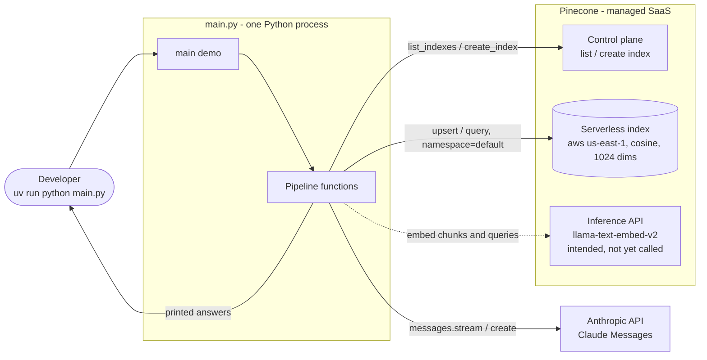
```mermaid
flowchart LR
    dev([Developer<br/>uv run python main.py])

    subgraph proc [main.py - one Python process]
        demo[main demo]
        lib[Pipeline functions]
    end

    subgraph pinecone [Pinecone - managed SaaS]
        cp[Control plane<br/>list / create index]
        idx[(Serverless index<br/>aws us-east-1, cosine, 1024 dims)]
        inf[Inference API<br/>llama-text-embed-v2<br/>intended, not yet called]
    end

    claude[Anthropic API<br/>Claude Messages]

    dev --> demo --> lib
    lib -- "list_indexes / create_index" --> cp
    lib -- "upsert / query, namespace=default" --> idx
    lib -. "embed chunks and queries" .-> inf
    lib -- "messages.stream / create" --> claude
    lib -- "printed answers" --> dev
```

**Key point:** the code only coordinates; the heavy work (embedding, similarity search, generation) happens in two external services. The dotted edge shows the intended embedding path. Today the code calls Anthropic for embeddings instead, which fails (§17).

---

## 3. Components and Responsibilities

All components live in `main.py` as plain functions, layered from low-level to high-level:

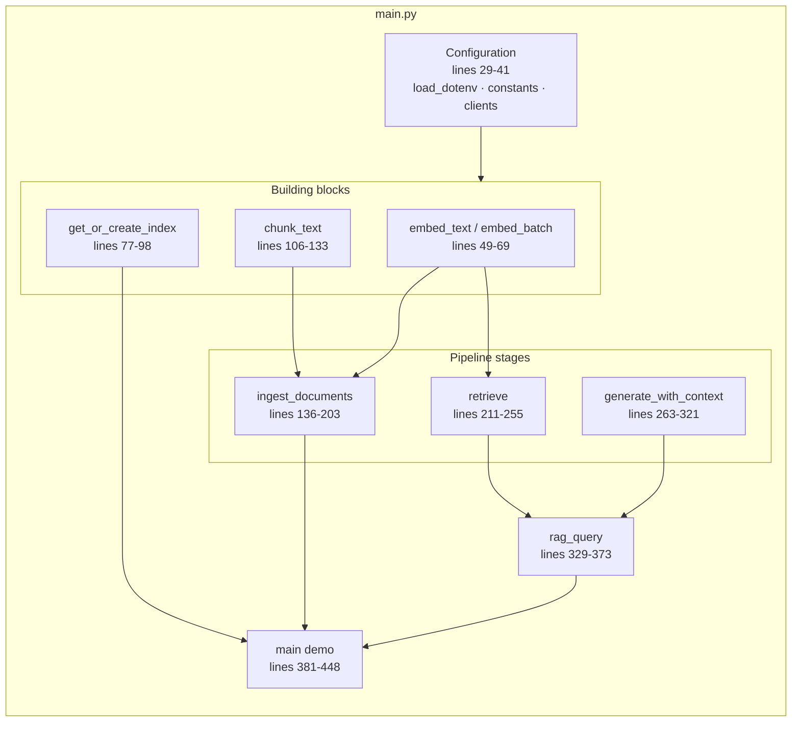
```mermaid
flowchart TB
    subgraph mainpy [main.py]
        direction TB
        cfg["Configuration<br/>lines 29-41<br/>load_dotenv · constants · clients"]

        subgraph l1 [Building blocks]
            emb["embed_text / embed_batch<br/>lines 49-69"]
            idxf["get_or_create_index<br/>lines 77-98"]
            chunk["chunk_text<br/>lines 106-133"]
        end

        subgraph l2 [Pipeline stages]
            ing["ingest_documents<br/>lines 136-203"]
            ret["retrieve<br/>lines 211-255"]
            gen["generate_with_context<br/>lines 263-321"]
        end

        rag["rag_query<br/>lines 329-373"]
        demo["main demo<br/>lines 381-448"]
    end

    cfg --> l1
    chunk --> ing
    emb --> ing
    emb --> ret
    ret --> rag
    gen --> rag
    idxf --> demo
    ing --> demo
    rag --> demo
```

| Component | Lines | Responsibility | Notes |
|---|---|---|---|
| Configuration | `main.py:29-41` | Loads `.env`, sets constants, creates the Anthropic and Pinecone clients | Clients are created at import time but make **no network calls** then ✅ |
| Embedding | `main.py:49-69` | Text → vectors (single and batch) | ❌ Calls a non-existent Anthropic API |
| Index management | `main.py:77-98` | Get or create the serverless index | Region and cloud are hardcoded |
| Chunking | `main.py:106-133` | Word-based windows (500 words, 50 overlap) | Can emit a fully duplicated last chunk (§17) |
| Ingestion | `main.py:136-203` | Documents → chunks → vectors → upsert | Generic: accepts any `{id, text, metadata}` list |
| Retrieval | `main.py:211-255` | Question → vector → top-k → score gate | Namespace + optional metadata filter |
| Generation | `main.py:263-321` | Chunks + question → Claude answer | Streaming prints to stdout as it goes |
| Orchestration | `main.py:329-373` | `rag_query`: retrieve, then generate | Natural entry point for a future API |
| Demo | `main.py:381-448` | Ingest the samples, ask 3 questions | Runs only under `python main.py` |

**Architectural strength:** the functions take their dependencies (like `index`) as arguments and return plain data. That makes them easy to wrap in an HTTP layer or a test harness later. The main coupling is that output goes through `print()`, which a web layer would have to replace.

---

## 4. Execution Sequence

What happens on `uv run python main.py`:

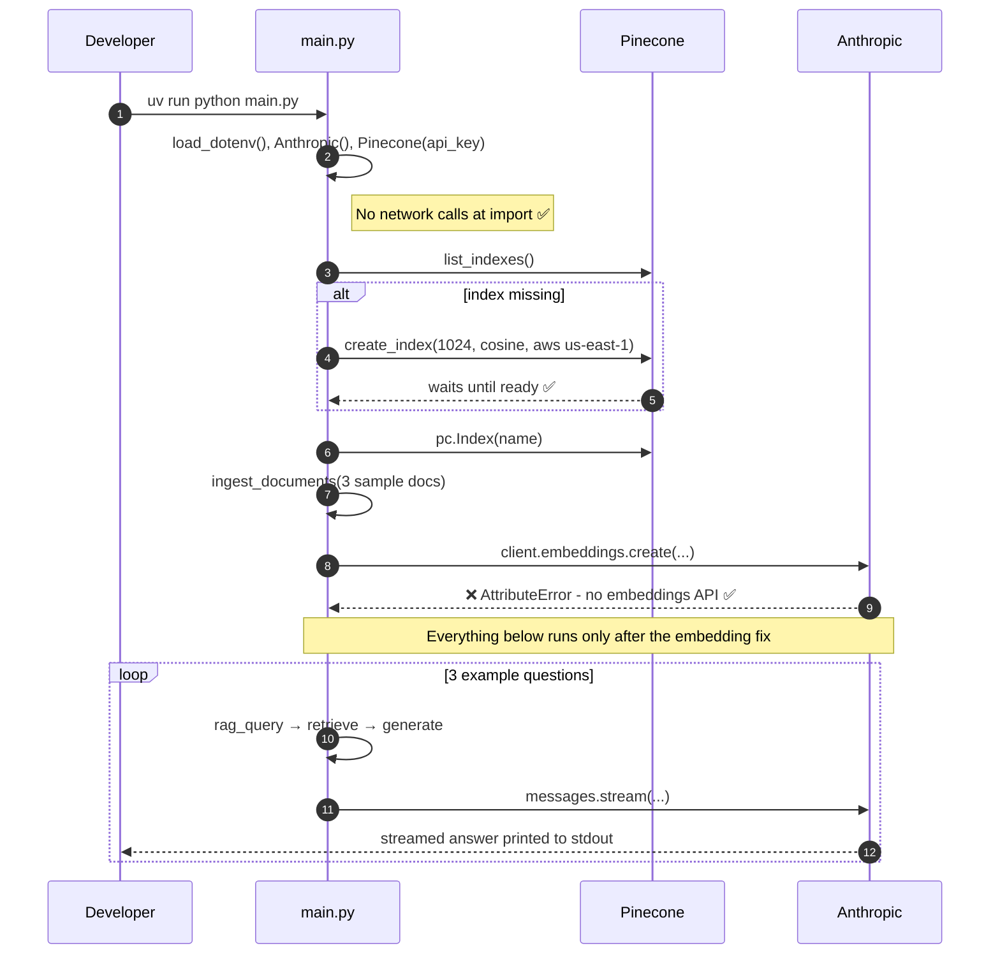
```mermaid
sequenceDiagram
    autonumber
    participant D as Developer
    participant M as main.py
    participant P as Pinecone
    participant A as Anthropic

    D->>M: uv run python main.py
    M->>M: load_dotenv(), Anthropic(), Pinecone(api_key)
    Note right of M: No network calls at import ✅
    M->>P: list_indexes()
    alt index missing
        M->>P: create_index(1024, cosine, aws us-east-1)
        P-->>M: waits until ready ✅
    end
    M->>P: pc.Index(name)
    M->>M: ingest_documents(3 sample docs)
    M->>A: client.embeddings.create(...)
    A-->>M: ❌ AttributeError - no embeddings API ✅
    Note over M,A: Everything below runs only after the embedding fix
    loop 3 example questions
        M->>M: rag_query → retrieve → generate
        M->>A: messages.stream(...)
        A-->>D: streamed answer printed to stdout
    end
```

**Side effects to be aware of:** a run may **create a Pinecone index** (paid resource) and **upserts vectors** every time. Upserts are idempotent: IDs are deterministic, so re-running overwrites the same records instead of duplicating them.

---

## 5. Ingestion Flow

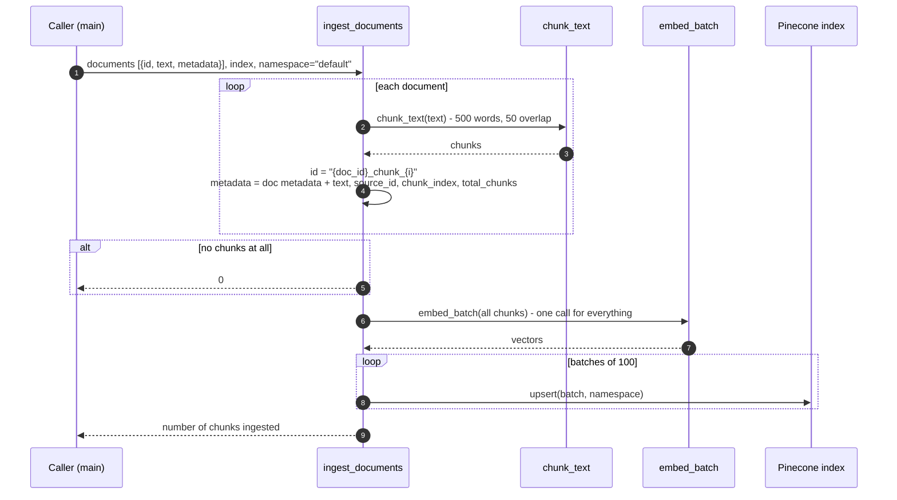
```mermaid
sequenceDiagram
    autonumber
    participant C as Caller (main)
    participant I as ingest_documents
    participant K as chunk_text
    participant E as embed_batch
    participant V as Pinecone index

    C->>I: documents [{id, text, metadata}], index, namespace="default"
    loop each document
        I->>K: chunk_text(text) - 500 words, 50 overlap
        K-->>I: chunks
        I->>I: id = "{doc_id}_chunk_{i}"<br/>metadata = doc metadata + text, source_id, chunk_index, total_chunks
    end
    alt no chunks at all
        I-->>C: 0
    end
    I->>E: embed_batch(all chunks) - one call for everything
    E-->>I: vectors
    loop batches of 100
        I->>V: upsert(batch, namespace)
    end
    I-->>C: number of chunks ingested
```

**Observations**
- **The sample documents are tiny.** Each is about 60 words, so each produces exactly **one chunk** ✅ and the overlap logic is never exercised. Three vectors in total.
- **All chunks are embedded in a single call.** That's fine for the samples. A real PDF with thousands of chunks would exceed the embedding API's per-request input limit, so batching is needed (§18).
- **Document metadata is spread into every chunk's metadata** (`**doc.get("metadata", {})`). Source and section travel with each chunk, which is what lets answers cite sources.

---

## 6. Query Flow

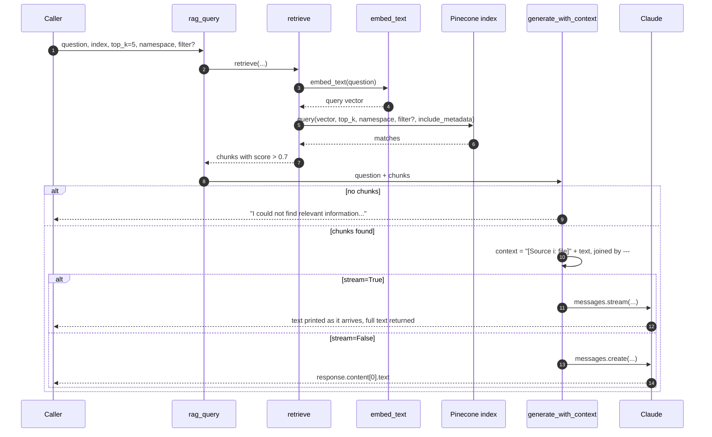
```mermaid
sequenceDiagram
    autonumber
    participant C as Caller
    participant R as rag_query
    participant RT as retrieve
    participant E as embed_text
    participant V as Pinecone index
    participant G as generate_with_context
    participant L as Claude

    C->>R: question, index, top_k=5, namespace, filter?
    R->>RT: retrieve(...)
    RT->>E: embed_text(question)
    E-->>RT: query vector
    RT->>V: query(vector, top_k, namespace, filter?, include_metadata)
    V-->>RT: matches
    RT-->>R: chunks with score > 0.7
    R->>G: question + chunks
    alt no chunks
        G-->>C: "I could not find relevant information..."
    else chunks found
        G->>G: context = "[Source i: file]" + text, joined by ---
        alt stream=True
            G->>L: messages.stream(...)
            L-->>C: text printed as it arrives, full text returned
        else stream=False
            G->>L: messages.create(...)
            L-->>C: response.content[0].text
        end
    end
```

### Decision logic

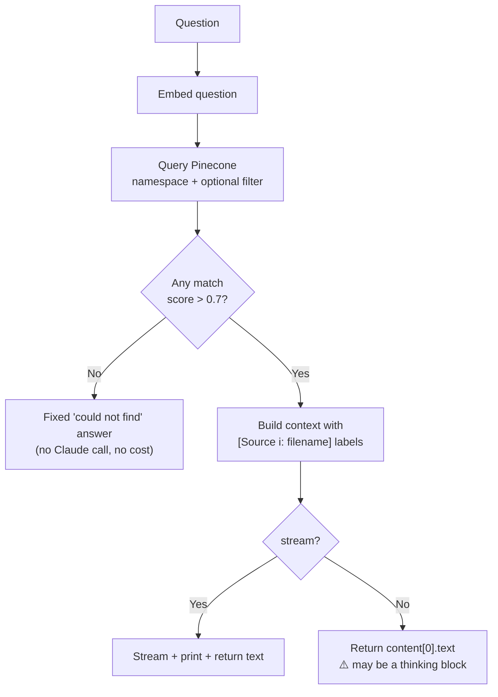
```mermaid
flowchart TD
    A[Question] --> B[Embed question]
    B --> C["Query Pinecone<br/>namespace + optional filter"]
    C --> D{"Any match<br/>score > 0.7?"}
    D -- No --> E["Fixed 'could not find' answer<br/>(no Claude call, no cost)"]
    D -- Yes --> F["Build context with<br/>[Source i: filename] labels"]
    F --> G{stream?}
    G -- Yes --> H[Stream + print + return text]
    G -- No --> I["Return content[0].text<br/>⚠️ may be a thinking block"]
```

**Observations**
- **Source labels make citations possible.** The system prompt asks Claude to "cite the source document", and each chunk is labeled with its `source` filename.
- **The 0.7 cutoff is a magic number.** Score ranges depend on the embedding model and metric, so it must be tuned once embeddings work. With only three sample chunks, a too-strict cutoff would make every answer "could not find".
- **`verbose=True` prints retrieved scores and sources**, which is useful for tuning that cutoff.

---

## 7. Data Model

The only persistent data lives in the Pinecone index:

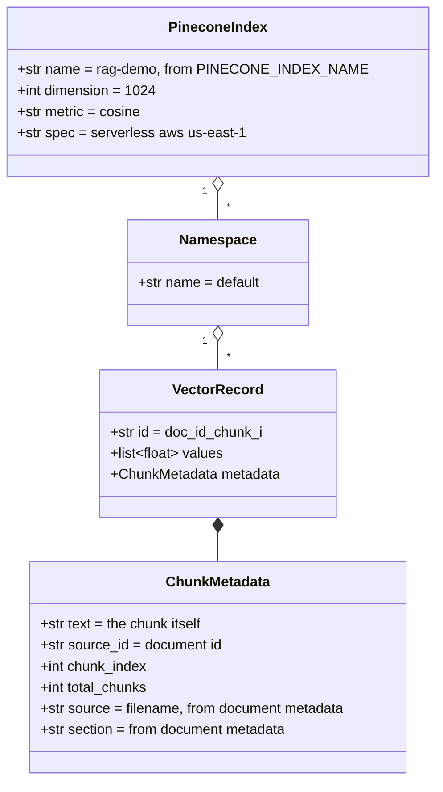
```mermaid
classDiagram
    class PineconeIndex {
        +str name = rag-demo, from PINECONE_INDEX_NAME
        +int dimension = 1024
        +str metric = cosine
        +str spec = serverless aws us-east-1
    }
    class Namespace {
        +str name = default
    }
    class VectorRecord {
        +str id = doc_id_chunk_i
        +list~float~ values
        +ChunkMetadata metadata
    }
    class ChunkMetadata {
        +str text = the chunk itself
        +str source_id = document id
        +int chunk_index
        +int total_chunks
        +str source = filename, from document metadata
        +str section = from document metadata
    }
    PineconeIndex "1" o-- "*" Namespace
    Namespace "1" o-- "*" VectorRecord
    VectorRecord *-- ChunkMetadata
```

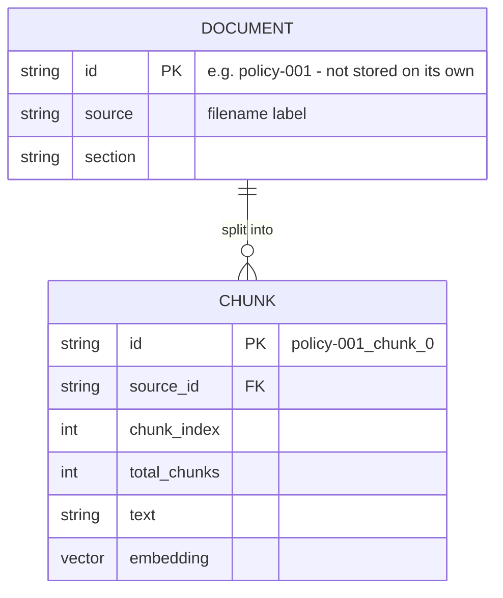
```mermaid
erDiagram
    DOCUMENT ||--o{ CHUNK : "split into"
    DOCUMENT {
        string id PK "e.g. policy-001 - not stored on its own"
        string source "filename label"
        string section
    }
    CHUNK {
        string id PK "policy-001_chunk_0"
        string source_id FK
        int chunk_index
        int total_chunks
        string text
        vector embedding
    }
```

**Implications**
- **A document only exists as metadata repeated across its chunks.** There's no document registry, so listing documents needs a separate store or a metadata scan.
- **Identity comes from the caller-supplied `id`**, not the filename. That's better than the earlier filename-based scheme, but the caller must keep IDs unique.
- **Re-ingesting a shorter version leaves orphans.** If a document produces fewer chunks than before, its old extra chunks remain and still turn up in search.
- **Namespaces provide isolation.** Everything currently goes to `"default"` (a literal name, not Pinecone's empty default namespace). A namespace per user or per document set gives cheap isolation and easy deletion.

---

## 8. Where State Lives

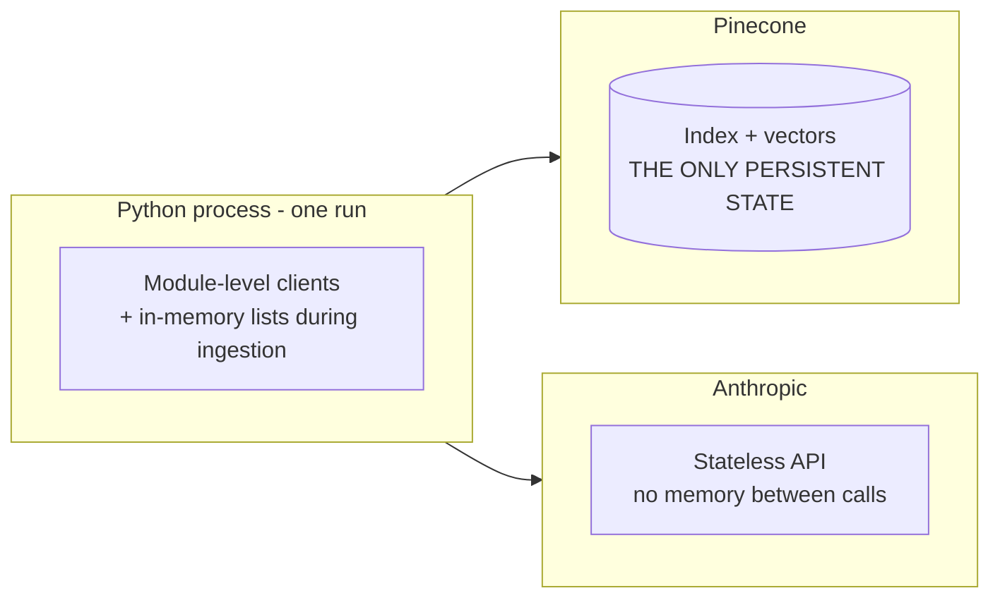
```mermaid
flowchart LR
    subgraph proc [Python process - one run]
        s1["Module-level clients<br/>+ in-memory lists during ingestion"]
    end
    subgraph pc [Pinecone]
        s2[("Index + vectors<br/>THE ONLY PERSISTENT STATE")]
    end
    subgraph an [Anthropic]
        s3["Stateless API<br/>no memory between calls"]
    end
    proc --> pc
    proc --> an
```

| State | Where | Lifetime |
|---|---|---|
| Index and vectors | Pinecone | Until deleted (no delete function exists) |
| Sample documents | Hardcoded in the demo | Source code |
| Conversation | **Nowhere.** Each `rag_query` is independent | — |
| Users, sessions, auth | Nowhere | — |

Because no state lives in the process, any future web layer on top of these functions can scale horizontally. Conversation history is the first feature that threatens that property.

---

## 9. Quality Attributes

| Attribute | Current assessment | Notes |
|---|---|---|
| **Correctness** | 🔴 | Embedding calls fail; generation calls are rejected; cutoff untuned |
| **Structure** | 🟢 | Clear layering; dependencies passed as arguments; docstrings explain trade-offs |
| **Availability** | 🟡 | No retries around Pinecone calls; the Anthropic SDK retries 429/5xx automatically |
| **Latency** | 🟡 | Each question makes 3 sequential network calls (embed → query → generate) |
| **Scalability** | 🟠 | Single-call embedding of all chunks won't scale to large documents |
| **Security** | 🟢 for now | No network-facing surface; keys only in `.env`. Becomes 🔴 the moment an unauthenticated API is added |
| **Cost control** | 🟡 | A run may create a paid index; each run re-embeds and re-upserts everything |
| **Observability** | 🟠 | `print()` progress only; no structured logs or token-usage tracking |
| **Testability** | 🟡 | Functions are testable with fake `index` objects; module-level clients still need patching |

---

## 10. Key Design Decisions and Trade-offs

Written as lightweight ADRs (architecture decision records), with the reasoning inferred from the code.

| # | Decision | Benefit | Cost / risk | Verdict |
|---|---|---|---|---|
| D1 | **Managed vector DB (Pinecone serverless)** | No infrastructure; filtering; namespaces | Vendor lock-in; paid; region hardcoded | ✅ Good for learning |
| D2 | **Embeddings: `llama-text-embed-v2` (Pinecone-hosted)** | One vendor for vectors and embeddings; 1024 dims matches the index | The code still calls Anthropic, which has no embeddings API | ✅ Right choice; wire it up (§18) |
| D3 | **Word-based fixed chunking (500 / 50)** | Simple, predictable, no tokenizer needed | Splits mid-sentence; words ≠ tokens | 🟡 Fine to start; consider sentence- or heading-aware splitting |
| D4 | **Namespace + optional metadata filter** | Isolation via namespaces; per-source filtering | Everything currently in one namespace | ✅ Good foundation |
| D5 | **Hard relevance gate (`score > 0.7`)** | Saves money; reduces made-up answers | False negatives; model-specific | 🟡 Make it a parameter and tune it |
| D6 | **Pipeline as plain functions + a demo** | Easy to read, reuse, and later wrap in an API | Output via `print()`; return types are loose dicts | ✅ Good for learning; add typed models later |
| D7 | **Inline sample documents** | Easy to follow along; known expected answers | Too small to exercise chunking; not real PDFs | ✅ Good for learning; add a PDF loader next |
| D8 | **Auto-create the index** | Zero manual setup | A demo run can create a paid resource | 🟡 Acceptable; note it in the README |

---

## 11. Designing Conversation History

Today every `rag_query` is independent. Supporting follow-ups like *"what about contractors?"* touches four areas: **the function signature, storage, retrieval, and prompt assembly.**

### 11.1 Option A — The caller passes the history (stateless)

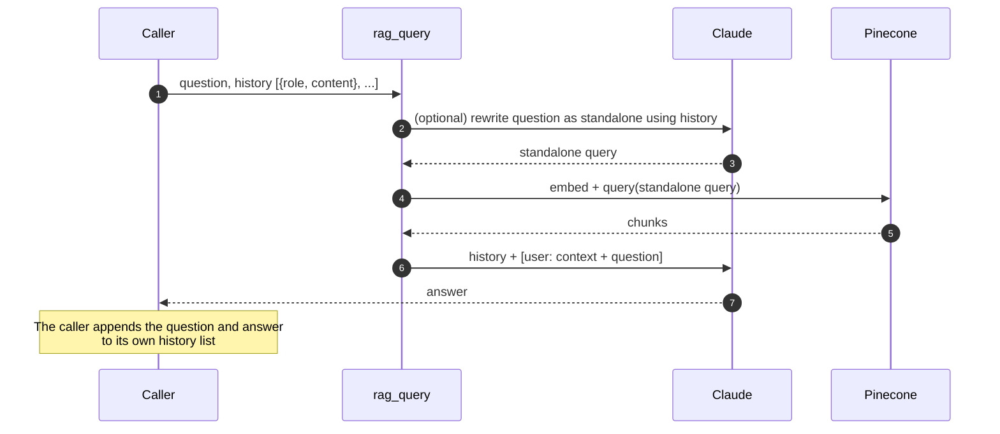
```mermaid
sequenceDiagram
    autonumber
    participant C as Caller
    participant R as rag_query
    participant L as Claude
    participant V as Pinecone

    C->>R: question, history [{role, content}, ...]
    R->>L: (optional) rewrite question as standalone using history
    L-->>R: standalone query
    R->>V: embed + query(standalone query)
    V-->>R: chunks
    R->>L: history + [user: context + question]
    L-->>C: answer
    Note over C: The caller appends the question and answer<br/>to its own history list
```

- ✅ No database; the pipeline stays stateless
- ✅ Small change: one new `history` parameter on `rag_query` and `generate_with_context`
- ❌ History is lost when the process ends unless the caller saves it
- ❌ The payload grows with every turn

### 11.2 Option B — The service stores conversations

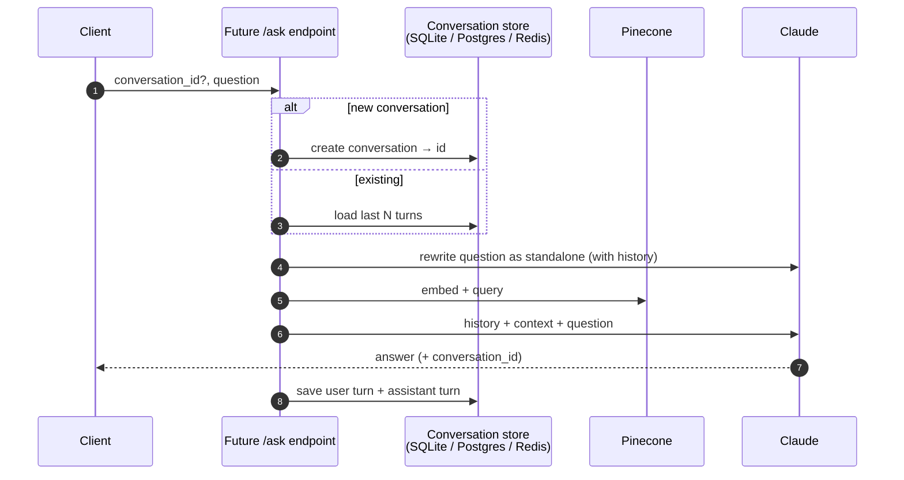
```mermaid
sequenceDiagram
    autonumber
    participant C as Client
    participant API as Future /ask endpoint
    participant DB as Conversation store<br/>(SQLite / Postgres / Redis)
    participant V as Pinecone
    participant L as Claude

    C->>API: conversation_id?, question
    alt new conversation
        API->>DB: create conversation → id
    else existing
        API->>DB: load last N turns
    end
    API->>L: rewrite question as standalone (with history)
    API->>V: embed + query
    API->>L: history + context + question
    L-->>C: answer (+ conversation_id)
    API->>DB: save user turn + assistant turn
```

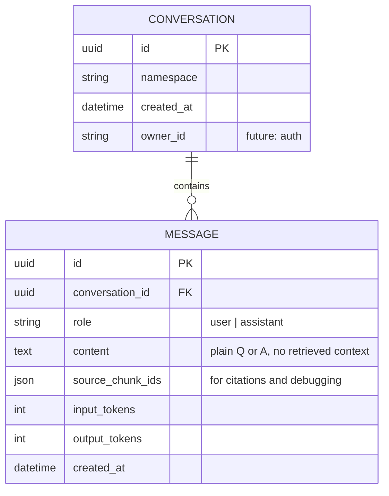
```mermaid
erDiagram
    CONVERSATION ||--o{ MESSAGE : contains
    CONVERSATION {
        uuid id PK
        string namespace
        datetime created_at
        string owner_id "future: auth"
    }
    MESSAGE {
        uuid id PK
        uuid conversation_id FK
        string role "user | assistant"
        text content "plain Q or A, no retrieved context"
        json source_chunk_ids "for citations and debugging"
        int input_tokens
        int output_tokens
        datetime created_at
    }
```

- ✅ History survives restarts and devices; can be audited
- ❌ Needs a database and an HTTP layer, neither of which exists yet
- ⚠️ **Don't** use an in-memory `dict` in a web server: it's lost on every `--reload` restart and isn't shared between workers

### 11.3 Cross-cutting design rules (either option)

1. **Store only the plain question and answer in history.** Attach retrieved chunks to the **latest** user turn only. Otherwise every past turn re-sends its context and token use grows quadratically.
2. **Rewrite the follow-up question before retrieval.** Embedding "what about contractors?" retrieves nothing useful. A cheap Claude call (e.g. `claude-haiku-4-5`) turns it into a standalone query first.
3. **Rethink the relevance gate.** A follow-up like "summarize what you just said" needs **no** retrieval, but the early return in `generate_with_context` would block it.
4. **Limit history** by number of turns or by tokens.
5. **Prompt caching.** With a stable system prompt and append-only history, `cache_control` bills repeated prefixes at roughly 10%.

**Recommendation:** start with **Option A**. It fits the current function-based design, needs no new infrastructure, and the demo can hold the history in a list. Move to **Option B** once an HTTP layer exists and history must persist.

---

## 12. Proposed Target Architecture

The pipeline functions are already the right core. The next steps add layers around them rather than rewriting them:

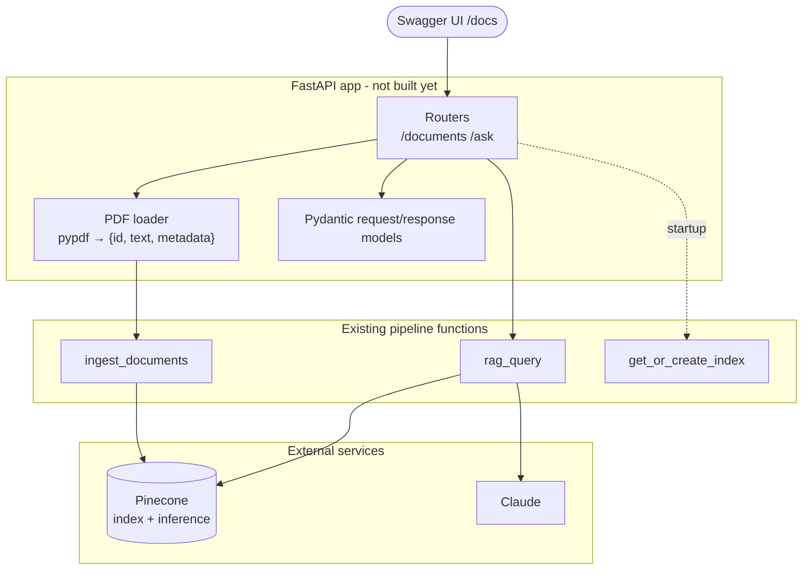
```mermaid
flowchart TB
    swagger([Swagger UI /docs]) --> api

    subgraph app [FastAPI app - not built yet]
        api["Routers<br/>/documents /ask"]
        loader["PDF loader<br/>pypdf → {id, text, metadata}"]
        schemas["Pydantic request/response models"]
    end

    subgraph core [Existing pipeline functions]
        ing[ingest_documents]
        rag[rag_query]
        idx[get_or_create_index]
    end

    subgraph ext [External services]
        pc[(Pinecone<br/>index + inference)]
        cl[Claude]
    end

    api --> schemas
    api --> loader --> ing
    api --> rag
    api -. startup .-> idx
    ing --> pc
    rag --> pc
    rag --> cl
```

| Step | What changes | Why |
|---|---|---|
| 1 | Fix embeddings and generation (§17) | The demo must run first |
| 2 | Add a PDF loader that emits the existing `{id, text, metadata}` shape, with page numbers in metadata | Reuses `ingest_documents` as-is; enables page citations |
| 3 | Add a thin FastAPI layer calling `ingest_documents` and `rag_query`; replace `print()` with return values or a streaming response | FastAPI is already a dependency; Swagger is the intended UI |
| 4 | Add conversation history (Option A) | Follow-up questions |

---

# Part II — Developer View

## 13. Local Setup Runbook

```bash
# 0. Make sure no other project's venv is active (see §21)
deactivate 2>/dev/null; unset VIRTUAL_ENV

# 1. Install dependencies into ./.venv from uv.lock
uv sync

# 2. Fill in .env (ANTHROPIC_API_KEY, PINECONE_API_KEY, PINECONE_INDEX_NAME)

# 3. Import check (no network calls)
uv run python -c "import main"

# 4. Run the demo (may create the index, upserts vectors, calls Claude)
uv run python main.py
```

The index is created automatically on the first run (serverless, AWS `us-east-1`, cosine, 1024 dimensions). If an index with that name already exists, its dimension must be 1024.

**Expected answers** for the demo questions, useful as a quick correctness check:

| Question | Expected answer (from the sample docs) |
|---|---|
| How do I reset my password? | Use the self-service portal at `portal.company.com/reset` |
| Can I work from home every day? | No: up to 3 days per week, with manager approval |
| How long do we keep customer data? | At least 7 years |

---

## 14. Configuration Reference

| Name | Kind | Default | Used at | Notes |
|---|---|---|---|---|
| `ANTHROPIC_API_KEY` | env | — | `main.py:40` (implicitly) | `Anthropic()` doesn't fail without it ✅; the first Claude call does |
| `PINECONE_API_KEY` | env | — | `main.py:41` | Missing → `PineconeValueError` at import ✅ |
| `PINECONE_INDEX_NAME` | env | `"rag-demo"` | `main.py:37` | Created automatically if missing |
| `EMBEDDING_MODEL` | const | `"llama-text-embed-v2"` | `main.py:35` | Pinecone-hosted, but passed to an Anthropic call today |
| `GENERATION_MODEL` | const | `"claude-sonnet-5-5"` | `main.py:36` | Current Sonnet ✅ |
| `EMBEDDING_DIMENSIONS` | const | `1024` | `main.py:38` | Matches `llama-text-embed-v2`'s default; the comment still says voyage-3 |
| `chunk_size` / `overlap` | params | `500` / `50` words | `main.py:108-109` | Words, not tokens |
| Relevance cutoff | literal | `0.7` | `main.py:254` | Should become a parameter |
| `max_tokens` | literal | `1024` | `main.py:303, 316` | Shared with thinking on Sonnet 5.5 |
| `temperature` | literal | `0.1` | `main.py:304, 317` | **Rejected by Sonnet 5.5** (400) |
| Index spec | literal | AWS `us-east-1`, cosine | `main.py:88-93` | Hardcoded |
| Namespace | default arg | `"default"` | several | Literal string name |

---

## 15. Function Reference

| Function | Signature (abridged) | Returns | Side effects |
|---|---|---|---|
| `embed_text` | `(text)` | `list[float]` | Network call |
| `embed_batch` | `(texts)` | `list[list[float]]` | Network call |
| `get_or_create_index` | `(index_name=INDEX_NAME)` | Pinecone `Index` | May create a paid index; prints |
| `chunk_text` | `(text, chunk_size=500, overlap=50)` | `list[str]` | None (pure) |
| `ingest_documents` | `(documents, index, namespace="default")` | `int` chunks ingested | Embeds, upserts, prints |
| `retrieve` | `(query, index, top_k=5, namespace="default", metadata_filter=None)` | `list[dict]` with `text, score, source, chunk_index, metadata` | Embeds, queries |
| `generate_with_context` | `(question, retrieved_chunks, system_prompt=None, stream=False)` | `str` answer | Calls Claude; prints when streaming |
| `rag_query` | `(question, index, top_k, namespace, metadata_filter, stream, verbose)` | `str` answer | All of the above |
| `main` | `()` | `None` | Runs the full demo |

**Document input shape** for `ingest_documents`:

```python
{"id": "policy-001", "text": "Full text...", "metadata": {"source": "hr_policy.pdf", "section": "Remote Work"}}
```

---

## 16. Code Walkthrough

| Lines | What happens | Comments |
|---|---|---|
| 1-21 | Module docstring | Outdated: says embeddings come from Anthropic and to install `pinecone-client` |
| 23-29 | Imports + `load_dotenv()` | `Optional` could be `X \| None` (ruff UP045) |
| 35-41 | Constants + clients | No network calls at import ✅ |
| 49-69 | `embed_text` / `embed_batch` | ❌ `client.embeddings` doesn't exist ✅ |
| 85-98 | Index get-or-create | `create_index` waits until the index is ready ✅; `pc.Index` is the compatibility alias for `pc.index(name=...)` |
| 125-133 | Word-window chunking | `range` step is `chunk_size - overlap`; `overlap >= chunk_size` breaks it |
| 163-176 | Build IDs and metadata | Document metadata is spread first, so pipeline keys override any same-named document keys |
| 183 | Single embedding call for all chunks | Needs batching for large inputs |
| 192-198 | Upsert in batches of 100 | pinecone 10's `upsert` also accepts `batch_size=` ✅ |
| 233-243 | Build query params | Filter only added when given ✅ |
| 253-254 | Score gate `> 0.7` | Magic number |
| 276-280 | Default system prompt | Asks for citations; could also say to ignore instructions found inside documents |
| 282-283 | No-chunks early return | Saves a Claude call |
| 299-312 | Streaming path | Uses `text_stream`, so thinking blocks are skipped ✅ |
| 313-321 | Non-streaming path | `content[0].text` assumes the first block is text |
| 438 | `answer = rag_query(...)` | Unused variable (ruff F841) |

---

## 17. Known Defects

Ordered by severity. "✅" means reproduced or verified against installed packages.

| # | Severity | Defect | Location | Fix |
|---|---|---|---|---|
| 1 | 🔴 Blocker | Anthropic client has no `embeddings` API → `AttributeError` ✅ | `main.py:56, 68` | Use `pc.inference.embed` (§18) |
| 2 | 🔴 Blocker | `temperature=0.1` rejected by `claude-sonnet-5-5` (400) | `main.py:304, 317` | Remove `temperature` |
| 3 | 🟠 High | Non-streaming path reads `content[0].text`; with thinking on by default, the first block can be a thinking block | `main.py:321` | Take the first block whose `type == "text"` |
| 4 | 🟠 High | `max_tokens=1024` is shared between thinking and the answer, so answers can be cut off | `main.py:303, 316` | Raise it (e.g. 16000) and check `stop_reason` |
| 5 | 🟡 Medium | All chunks embedded in one call; large documents exceed the per-request limit | `main.py:183` | Embed in batches (§18) |
| 6 | 🟡 Medium | A redundant last chunk: a 500-word document yields 2 chunks, the second fully contained in the first ✅ | `main.py:128-131` | Stop when `i + chunk_size >= len(words)` |
| 7 | 🟡 Medium | `overlap >= chunk_size` → `range` step ≤ 0 (error or no chunks) | `main.py:128` | Validate the parameters |
| 8 | 🟡 Medium | Orphan chunks when a document is re-ingested with fewer chunks | `main.py:167` | Delete by `source_id` before upserting |
| 9 | 🟢 Low | Outdated docstring and comment (Anthropic embeddings, `pinecone-client`, voyage-3) | `main.py:1-21, 38, 53` | Update the text |
| 10 | 🟢 Low | Ruff: `Optional` (UP045) and unused `answer` (F841) | `main.py:216, 266, 334, 438` | `uvx ruff check --fix .` plus a manual tweak |
| 11 | 🟢 Low | README still describes the old FastAPI endpoints | `README.md` | Rewrite for the script, or add the API layer back |
| 12 | 🟢 Low | Declared but unused dependencies: `fastapi`, `uvicorn`, `pypdf` | `pyproject.toml` | Keep if the API layer is coming back (§12); otherwise remove |

---

## 18. Fixing the Embedding Functions

A reference sketch, **not applied to `main.py`**. The `pc.inference.embed(model, inputs, parameters)` signature was checked against the installed pinecone 10.0.0 ✅. Confirm the exact `parameters` keys in Pinecone's docs for `llama-text-embed-v2`.

```python
def _embed(inputs: list[str], input_type: str) -> list[list[float]]:
    result = pc.inference.embed(
        model=EMBEDDING_MODEL,
        inputs=inputs,
        parameters={"input_type": input_type, "truncate": "END"},
    )
    return [e.values for e in result]  # verify attribute name against EmbeddingsList


def embed_batch(texts: list[str], batch_size: int = 96) -> list[list[float]]:
    # Hosted embedding endpoints cap inputs per request, so send them in batches
    out: list[list[float]] = []
    for i in range(0, len(texts), batch_size):
        out.extend(_embed(texts[i : i + batch_size], "passage"))
    return out


def embed_text(text: str) -> list[float]:
    return _embed([text], "query")[0]
```

**Why `input_type` matters:** asymmetric retrieval models embed *passages* (documents) and *queries* (questions) differently. Using the wrong type on either side quietly lowers retrieval quality, and so the scores that the 0.7 cutoff depends on.

### Chunking at a glance

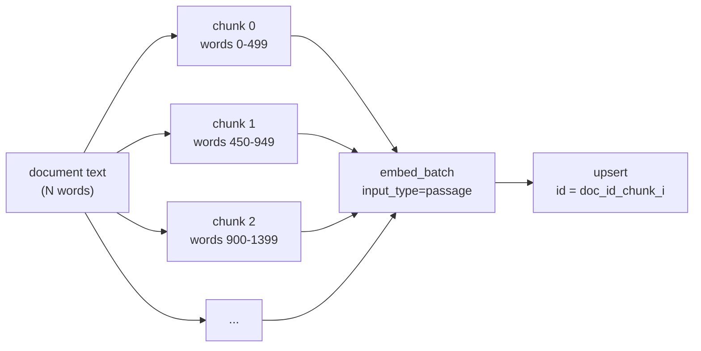
```mermaid
flowchart LR
    T["document text<br/>(N words)"] --> W1["chunk 0<br/>words 0-499"]
    T --> W2["chunk 1<br/>words 450-949"]
    T --> W3["chunk 2<br/>words 900-1399"]
    T --> Wn["..."]
    W1 & W2 & W3 & Wn --> E["embed_batch<br/>input_type=passage"]
    E --> U["upsert<br/>id = doc_id_chunk_i"]
```

---

## 19. Dependencies

Declared in `pyproject.toml`, locked in `uv.lock`:

| Package | Role | Used by current code? |
|---|---|---|
| `anthropic` | Claude client | ✅ Generation (and, incorrectly, embeddings) |
| `pinecone` | Vector DB + inference client | ✅ Index management, upsert, query |
| `python-dotenv` | `.env` loader | ✅ |
| `fastapi` | Web framework | ❌ Not imported (planned API layer) |
| `uvicorn` | ASGI server | ❌ Not used |
| `pypdf` | PDF text extraction | ❌ Not imported (planned PDF loader) |

**Missing for a fuller project:** a test stack (`pytest`), `ruff` as a dev dependency (it currently runs through `uvx`), and structured logging.

**Python version:** `.python-version` = 3.13 and `requires-python >= 3.13` ✅.

---

## 20. Testing Strategy

There are no tests yet. The function-based design makes this straightforward:

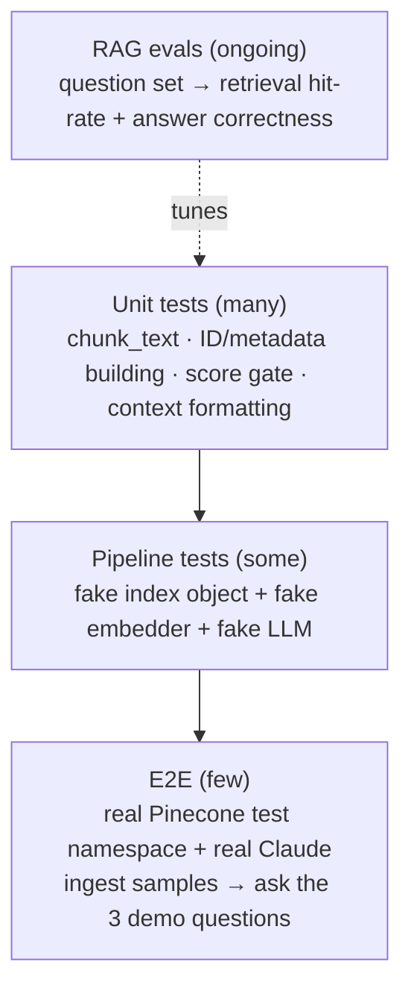
```mermaid
flowchart TB
    e2e["E2E (few)<br/>real Pinecone test namespace + real Claude<br/>ingest samples → ask the 3 demo questions"]
    integ["Pipeline tests (some)<br/>fake index object + fake embedder + fake LLM"]
    unit["Unit tests (many)<br/>chunk_text · ID/metadata building · score gate · context formatting"]
    evals["RAG evals (ongoing)<br/>question set → retrieval hit-rate + answer correctness"]
    unit --> integ --> e2e
    evals -.tunes.-> unit
```

| Layer | Examples |
|---|---|
| Unit | `chunk_text`: covers all words, correct overlap, no redundant last chunk, rejects bad parameters, empty text → `[]` |
| Pipeline | `ingest_documents` builds the right IDs and metadata; `retrieve` drops matches ≤ 0.7; `generate_with_context` returns the fallback message when there are no chunks |
| E2E | The three demo questions return the expected answers (§13) |
| Evals | Add 10-20 questions about the sample docs, including unanswerable ones, and track accuracy when changing the chunk size, cutoff or model |

**Seam for fakes:** `ingest_documents`, `retrieve` and `rag_query` already take `index` as a parameter. Only the module-level `client` and `pc` need patching.

---

## 21. Development Environment Gotchas

Problems that already came up on this machine:

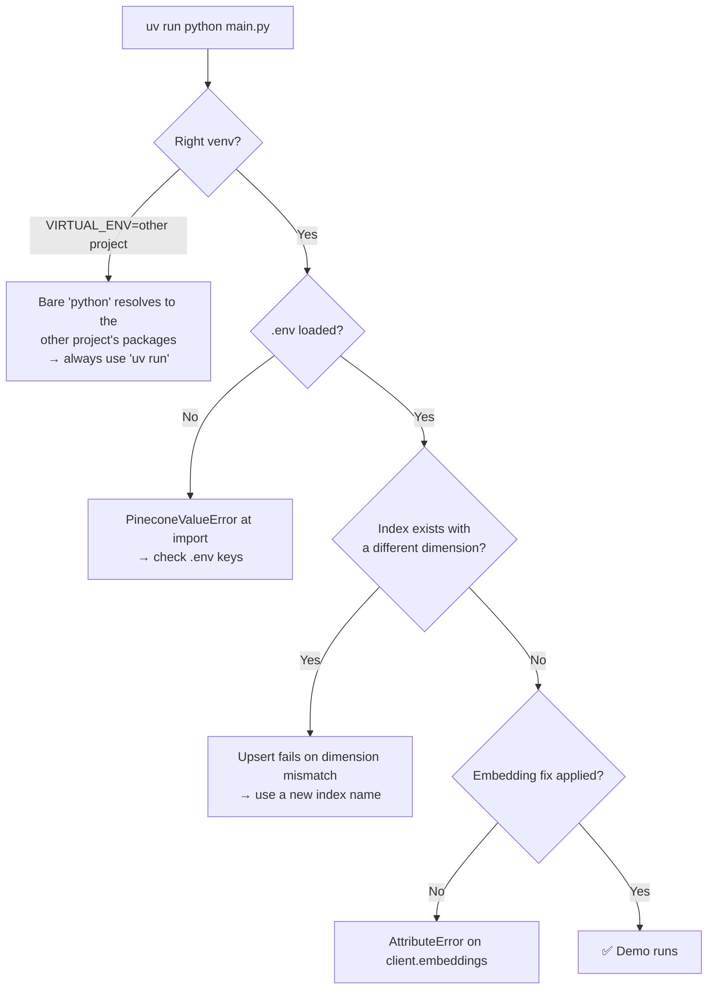
```mermaid
flowchart TD
    A[uv run python main.py] --> B{Right venv?}
    B -- "VIRTUAL_ENV=other project" --> C["Bare 'python' resolves to the<br/>other project's packages<br/>→ always use 'uv run'"]
    B -- Yes --> D{".env loaded?"}
    D -- No --> E["PineconeValueError at import<br/>→ check .env keys"]
    D -- Yes --> F{"Index exists with<br/>a different dimension?"}
    F -- Yes --> G["Upsert fails on dimension mismatch<br/>→ use a new index name"]
    F -- No --> H{Embedding fix applied?}
    H -- No --> I["AttributeError on client.embeddings"]
    H -- Yes --> J[✅ Demo runs]
```

- **`uv run` vs bare commands:** `uv` ignores an activated venv that belongs to another project (it prints a warning). `PATH`-based commands don't, so `uv run` is the safe default.
- **Orphan dev servers:** if a FastAPI layer comes back, `--reload` starts a watcher plus a worker process, and closing the terminal doesn't always stop them. `lsof -nP -iTCP:8000 -sTCP:LISTEN` finds them.

---

# Part III — Product Manager View

## 22. Product Summary

**One-liner:** *"A hands-on RAG reference pipeline: ingest documents, ask questions, get answers grounded in those documents."*

**Value:** it's a learning project. The value is understanding each RAG stage (chunking, embedding, retrieval, grounded generation) in code that's small enough to read in one sitting, with sample data whose correct answers are known.

**Positioning:** a reference implementation, not an end-user product. It's a foundation that can grow into a "chat with your docs" API (§12).

---

## 23. Users and Jobs-to-be-Done

| Persona | Job to be done | Served today? |
|---|---|---|
| **Learner (primary)** | "Understand how RAG works by running and changing it" | 🟡 The code reads well; the demo needs the two blocker fixes |
| **Developer / integrator** | "Reuse these functions in my own app" | 🟡 Functions are reusable; no typed models or package structure |
| **Knowledge worker** | "Ask questions about my PDFs" | ❌ No PDF loader, no UI |

---

## 24. Capability Assessment

| Capability | Status | Notes |
|---|---|---|
| Ingest text documents | 🟡 Built, not working | Blocked by the embedding call |
| Ingest real PDFs | ❌ | `pypdf` declared, no loader |
| Answer questions grounded in documents | 🟡 Built, not working | Blocked by `temperature` |
| Streaming answers | ✅ Designed | Printed to the terminal |
| Source citations | ✅ Designed | Chunks are labeled with their source filename |
| "Not in documents" honesty | ✅ Designed | Score gate + prompt instruction |
| Metadata filtering / namespaces | ✅ Designed | Supported by `retrieve` |
| Follow-up questions (history) | ❌ | See §11 |
| HTTP API / Swagger | ❌ | FastAPI declared, not used |
| Page-number citations | ❌ | Needs a PDF loader that records pages |

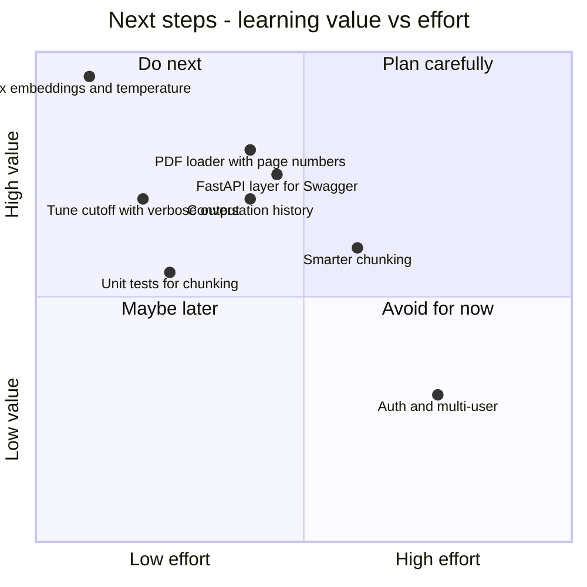
```mermaid
quadrantChart
    title Next steps - learning value vs effort
    x-axis Low effort --> High effort
    y-axis Low value --> High value
    quadrant-1 Plan carefully
    quadrant-2 Do next
    quadrant-3 Maybe later
    quadrant-4 Avoid for now
    Fix embeddings and temperature: [0.1, 0.95]
    Tune cutoff with verbose output: [0.2, 0.7]
    PDF loader with page numbers: [0.4, 0.8]
    FastAPI layer for Swagger: [0.45, 0.75]
    Conversation history: [0.4, 0.7]
    Unit tests for chunking: [0.25, 0.55]
    Smarter chunking: [0.6, 0.6]
    Auth and multi-user: [0.75, 0.3]
```

---

## 25. Learner Journey

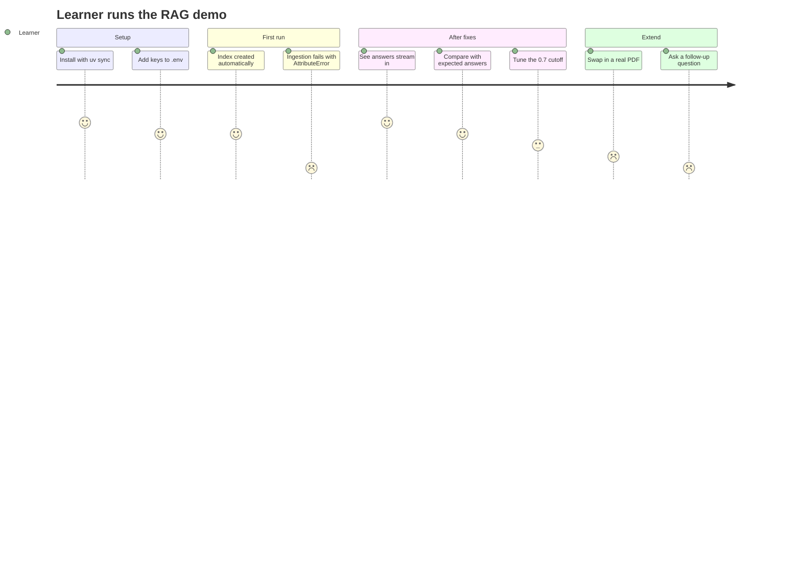
```mermaid
journey
    title Learner runs the RAG demo
    section Setup
      Install with uv sync: 5: Learner
      Add keys to .env: 4: Learner
    section First run
      Index created automatically: 4: Learner
      Ingestion fails with AttributeError: 1: Learner
    section After fixes
      See answers stream in: 5: Learner
      Compare with expected answers: 4: Learner
      Tune the 0.7 cutoff: 3: Learner
    section Extend
      Swap in a real PDF: 2: Learner
      Ask a follow-up question: 1: Learner
```

The lowest-scoring steps (**the first-run failure, real PDFs, follow-ups**) map directly to the roadmap below.

---

## 26. Risk Register

| # | Risk | Likelihood | Impact | Mitigation |
|---|---|---|---|---|
| R1 | Demo can't run end to end | Certain (today) | High | Fix defects 1-2 in §17 |
| R2 | Docs drift from code (README describes old endpoints) | Certain (today) | Medium | Update the README alongside code changes |
| R3 | Untuned cutoff hides correct answers | Medium | Medium | Use `verbose=True` to inspect scores; tune against the expected answers |
| R4 | Unexpected Pinecone cost from auto-created indexes | Low | Low | Serverless pricing is usage-based; delete unused indexes |
| R5 | Prompt injection via document content | Low (sample data) | Medium | Matters once real PDFs are loaded; harden the system prompt |
| R6 | Adding an API without auth exposes paid calls | Medium (if deployed) | High | Keep it local, or add auth and rate limits first |

---

## 27. Roadmap


```mermaid
flowchart LR
    subgraph NOW [Now - make it run]
        n1[Fix embeddings via Pinecone inference]
        n2[Remove temperature, raise max_tokens]
        n3[Run demo, check expected answers]
        n4[Update README]
    end
    subgraph NEXT [Next - make it real]
        x1[PDF loader with page numbers]
        x2[FastAPI layer for Swagger]
        x3[Tune the cutoff]
        x4[Unit tests for chunking]
    end
    subgraph LATER [Later - make it richer]
        l1[Conversation history]
        l2[Smarter chunking]
        l3[Evals]
        l4[Namespaces per document set]
    end
    NOW --> NEXT --> LATER
```

**Suggested sequencing:** "Now" is a short session. The PDF loader and the FastAPI layer pair naturally, since uploading a PDF through Swagger is the original goal in the README.

---

## 28. Success Metrics

For a learning project, the metrics are about correctness and understanding rather than usage:

| Category | Metric | Target |
|---|---|---|
| Correctness | Demo questions answered correctly | 3 / 3 |
| Correctness | Unanswerable questions get the "could not find" reply | 100% on a small set |
| Retrieval | Correct chunk retrieved for each demo question | 3 / 3, with scores above the cutoff |
| Reliability | Demo runs end to end without errors | Every run |
| Learning | Each pipeline stage changed and re-tested at least once (chunk size, cutoff, model) | Done |

---

## 29. Open Questions

1. **Is the HTTP layer coming back?** That decides whether `fastapi`, `uvicorn` and `pypdf` stay as dependencies.
2. **Which PDFs come next?** Real documents will exercise chunking, which the 60-word samples don't.
3. **History: in-memory list or persistent?** Option A is enough for a terminal demo.
4. **Do answers need page-level citations?** If so, the PDF loader must capture page numbers before anything is indexed.
5. **Should the cutoff be a parameter of `retrieve`?** That would make tuning experiments much easier.

---

## Appendix A — Glossary

| Term | Meaning |
|---|---|
| **RAG** | Retrieval-Augmented Generation: fetch relevant text first, then have the LLM answer using it |
| **Embedding** | A list of numbers representing text meaning; similar text → nearby vectors |
| **Chunk** | A slice of a document small enough to embed and to fit several in a prompt |
| **Overlap** | Words shared between neighbouring chunks so sentences on a boundary aren't lost |
| **Vector index** | A database tuned for "find the nearest vectors" (Pinecone here) |
| **Namespace** | A partition inside one Pinecone index; useful per user or per document set |
| **top_k** | How many nearest chunks to retrieve |
| **Similarity score** | How close a chunk is to the question (cosine); gated at 0.7 here |
| **Serverless index** | A Pinecone index billed by usage, with no pods to manage |
| **input_type** | Tells an asymmetric embedding model whether text is a passage or a query |
| **Question rewriting** | Using the LLM to turn a follow-up ("what about it?") into a standalone query before retrieval |
