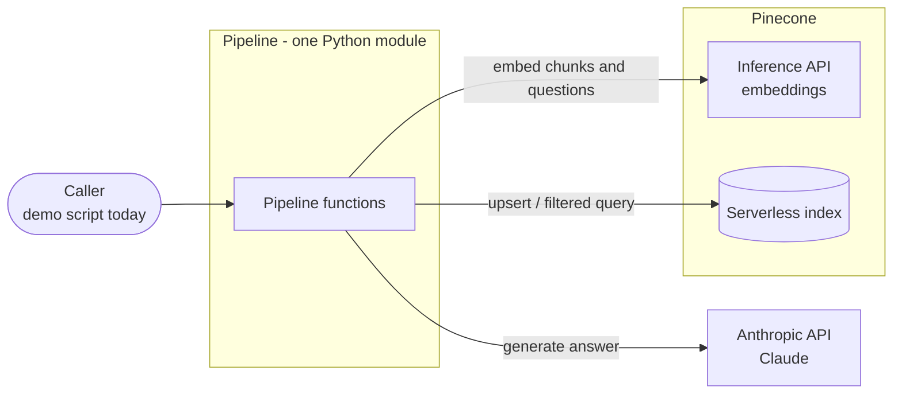
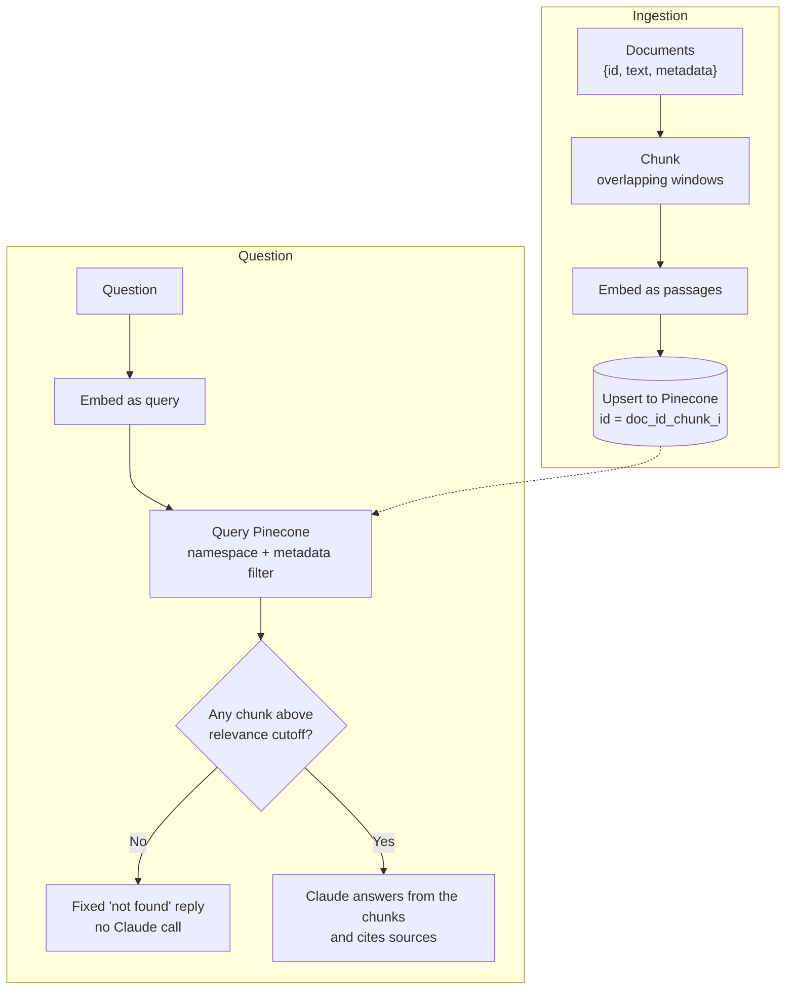

# Architecture

A short map of how this RAG pipeline is put together. **Why** each choice was made is in [`docs/decisions/`](docs/decisions/); planned work and known gaps are in [`PRD.md`](PRD.md).

## Overview

Documents are split into overlapping chunks, embedded, and stored in Pinecone. A question is embedded the same way. The most relevant chunks are retrieved and sent to Claude, which answers using only those chunks and cites their source filenames.

The code coordinates; the heavy work happens in two external services:

## Code map

Everything lives in the root module as plain functions, layered from low to high level ([ADR 0005](docs/decisions/0005-structure-pipeline-as-plain-functions.md)):

| Layer | Functions | Responsibility |
|---|---|---|
| Building blocks | `embed_text`, `embed_batch`, `get_or_create_index`, `chunk_text` | Turn text into vectors; get the index; split text |
| Pipeline stages | `ingest_documents`, `retrieve`, `generate_with_context` | Store documents; find relevant chunks; answer from them |
| Orchestration | `rag_query` | Retrieve, then generate. The entry point for any caller |
| Demo | `main` | Ingest the inline sample documents and ask the demo questions |

Functions receive their dependencies (such as the Pinecone `index`) as arguments and return plain data, so a future HTTP layer or test harness can call them directly.

## Data flow

## Data model

Pinecone is the only persistent store. Each vector record is one chunk:

| Field | Meaning |
|---|---|
| `id` | `{doc_id}_chunk_{i}`. Deterministic, so re-ingesting overwrites instead of duplicating |
| `values` | The embedding; its size must match the index dimension |
| `metadata.text` | The chunk text, sent to Claude as context |
| `metadata.source` | The document's filename, used for citations and per-document filtering |
| `metadata.source_id`, `chunk_index`, `total_chunks` | The chunk's place in its document |
| `metadata.allowed_groups` | Groups permitted to see the document (planned, [ADR 0006](docs/decisions/0006-enforce-permissions-in-retrieval-filter.md)) |

A document exists only as metadata repeated across its chunks; there's no separate document registry. Nothing is kept between runs except Pinecone's contents.

## Invariants

Rules that must stay true when changing the code:

1. **Chunks and questions use the same embedding model**, with `passage` for chunks and `query` for questions. The index dimension matches the model's output ([0002](docs/decisions/0002-use-pinecone-hosted-embeddings.md)).
2. **Claude only answers from retrieved chunks.** No relevant chunks means the fixed "not found" reply, with no generation call ([0004](docs/decisions/0004-gate-generation-on-retrieval-relevance.md)).
3. **Every chunk carries its document's filename** in `source`, so answers can cite it.
4. **Permissions are enforced in the Pinecone query filter, never in the prompt.** Untagged documents are visible to no one ([0006](docs/decisions/0006-enforce-permissions-in-retrieval-filter.md)). *Planned.*
5. **A question without a user sees nothing** ([0007](docs/decisions/0007-no-user-means-no-access.md)). *Planned.*

## Extension points

- **HTTP API:** wrap `rag_query` and `ingest_documents` in FastAPI (already a dependency). `print()` output would need to become return values or a streaming response.
- **Real PDFs:** a loader only has to produce `{id, text, metadata}` documents, ideally with page numbers in the metadata for page-level citations.
- **Conversation history:** pass prior turns into `rag_query`, and rewrite follow-up questions into standalone ones before retrieval.
