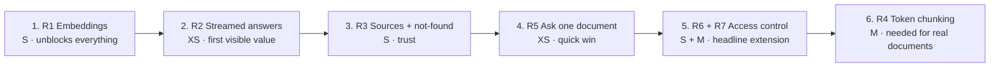

# PRD — RAG Demo: Grounded Q&A over Sample Documents, then Permission-Aware Knowledge Base

**Status:** Draft · **Owner:** Luis Solorzano · **Date:** 2026-10-06
**Related:** [ARCHITECTURE.md](ARCHITECTURE.md) · [Decision records](docs/decisions/) · [Implementation order](#9-implementation-order)

---

## 1. Problem Statement

People asking questions about internal policies (passwords, remote work, data retention) have to find and read the right document themselves, and a general chatbot may confidently make up an answer. This demo shows the alternative: answers that come **only** from the organization's documents, cite their source, and say "I don't know" when the documents don't cover the question.

The pipeline code is mostly written but **doesn't run end to end yet** (the embedding and generation calls fail), so no one can see that value today. The extension adds a second problem real organizations have: **not everyone may see every document**, so the knowledge base must answer each person only from the documents they're permitted to see.

## 2. Goals

1. **The demo answers questions end to end:** all 3 demo questions get correct, streamed answers from a fresh run.
2. **Answers can be trusted:** every answer cites the source filename(s) it used, and questions the documents don't cover get the "could not find" reply instead of a guess.
3. **Ingestion works beyond toy inputs:** documents of any length are split into ~600-token overlapping chunks, with no duplicated or lost text.
4. **Permissions are enforced:** across a defined user × document test matrix, no user ever receives content, or a source citation, from a document they aren't permitted to see.

## 3. Non-Goals

| Non-goal | Why |
|---|---|
| **Real authentication** (logins, passwords, SSO, tokens) | The demo passes the user's identity in directly. Access *enforcement* is the lesson; identity is a separate problem. |
| **HTTP API / Swagger UI** | The script demo shows the value with less code. The functions are already shaped to be wrapped later ([ARCHITECTURE §12](ARCHITECTURE.md#12-proposed-target-architecture)). |
| **Parsing real PDF files** | The sample documents carry PDF filenames, so the same pipeline applies to PDFs later. A PDF loader is a follow-up. |
| **Conversation history / follow-up questions** | A separate feature with its own design ([ARCHITECTURE §11](ARCHITECTURE.md#11-designing-conversation-history)). |
| **Admin UI for managing permissions** | Permissions are set in code or config for the demo. |

## 4. Personas

| Persona | Description | Demo identity |
|---|---|---|
| **Employee** | Any staff member asking everyday policy questions | `alex` → groups `[all-staff]` |
| **Legal / compliance staff** | Also needs restricted governance documents | `jordan` → groups `[all-staff, legal]` |
| **Demo presenter / developer** | Runs the demo, adds documents, sets permissions | Runs the script |

## 5. User Stories

### Phase 1 — Grounded Q&A over the sample documents

**US-1. Ask a question, get a streamed answer.**
As an **employee**, I want to ask a policy question in plain language and see the answer appear as it's written, so that I get help quickly without reading whole documents.
- The answer streams to the terminal as it's generated, not after a long pause.
- The answer uses only information from the ingested documents.
- *Edge:* if Claude returns an error mid-answer, the run reports it clearly instead of failing silently.

**US-2. Know where an answer came from.**
As an **employee**, I want each answer to name the document(s) it's based on, so that I can trust it and check the original policy if needed.
- Sources are the documents' filenames (e.g. `hr_policy.pdf`).
- Only documents whose chunks were actually used are cited.

**US-3. Get an honest "I don't know".**
As an **employee**, I want a clear "I couldn't find this in the documents" reply when no document covers my question, so that I'm never misled by a confident wrong answer.
- *Edge:* off-topic questions ("What's the capital of France?") get the not-found reply.
- *Edge:* questions that are only slightly related don't produce made-up policy details.

**US-4. Load documents into the knowledge base.**
As a **demo presenter**, I want to load documents so that they're split into overlapping ~600-token chunks, embedded, and stored with their filename, so that questions can be answered from any part of any document.
- Every stored chunk is tagged with its document's filename.
- Long documents produce several chunks that overlap, so a sentence on a boundary is never lost.
- *Edge:* re-running ingestion with the same documents doesn't create duplicates.
- *Edge:* an empty document is skipped without an error.

**US-5. Ask about one specific document.**
As an **employee**, I want to limit a question to a single document by its filename, so that I get an answer from the policy I care about and not from a similar one.
- *Edge:* naming a document that doesn't exist gives the not-found reply, not an error.

### Phase 2 — Multi-document knowledge base with access control

**US-6. Set who can see each document.**
As a **demo presenter**, I want to assign each document the groups permitted to see it when I load it, so that restricted policies are only available to the right people.
- A document can be visible to one group or several.
- *Edge:* a document loaded **without** any groups is visible to **no one** (deny by default).

**US-7. Only get answers from documents I'm allowed to see.**
As an **employee**, I want my questions answered only from documents I'm permitted to see, so that restricted information is never exposed to me.
As **legal staff**, I want restricted documents included in my answers, so that I can do my job.
- The same question gives different answers depending on who asks (e.g. Alex vs. Jordan asking about data retention).
- *Edge:* when the only matching document is restricted, the user gets the **same** not-found reply as for a document that doesn't exist. The reply must not reveal that a restricted document exists.
- *Edge:* an unknown user sees nothing.
- *Edge:* cited sources never include a document the user can't see.

## 6. Requirements

Key decisions:
- **"~600 units" means ~600 tokens**, with ~60 tokens (10%) of overlap. Chunk size is measured with a tokenizer, not by counting words. The existing word-based chunker must change (R4). 600 tokens is well within `llama-text-embed-v2`'s input limit.
- **Permissions are enforced as a filter inside the Pinecone search**, never by instructing Claude. Claude only ever receives chunks the user is allowed to see. See ADRs [0003](docs/decisions/0003-size-chunks-in-tokens.md), [0006](docs/decisions/0006-enforce-permissions-in-retrieval-filter.md) and [0007](docs/decisions/0007-no-user-means-no-access.md).

| ID | Priority | Requirement | Stories | Size |
|---|---|---|---|---|
| R1 | **P0** | Embed chunks and questions with Pinecone-hosted `llama-text-embed-v2`, using `passage` for chunks and `query` for questions | US-1, US-4 | S |
| R2 | **P0** | Stream answers from `claude-sonnet-5-5` with valid request parameters | US-1 | XS |
| R3 | **P0** | Cite source filenames; give the not-found reply when retrieval finds nothing relevant; tune the relevance cutoff for the embedding model | US-2, US-3 | S |
| R4 | **P1** | ~600-token chunks with ~60-token overlap, measured with a tokenizer; no duplicated or lost text; invalid settings rejected | US-4 | M |
| R5 | **P1** | Optionally restrict a question to one document by filename | US-5 | XS |
| R6 | **P2** | Tag each document's chunks with allowed groups at ingestion; deny by default | US-6 | S |
| R7 | **P2** | Questions are asked as a user; retrieval returns only chunks the user's groups can see; no hint that restricted documents exist | US-7 | M |

Sizes: **XS** = under an hour · **S** = a short session · **M** = a session plus tests or a new decision.

### Acceptance criteria

**R1 — Embeddings**
- [x] Given the sample documents, ingestion completes and upserts 3 vectors with no `AttributeError` (verified with a fake index; a full demo run also needs R2).
- [x] Each stored vector has 1024 dimensions, matching the index (confirmed against the live API).
- [x] Chunks are embedded with `passage` and questions with `query`.
- [x] Ingesting 250 chunks makes multiple embedding requests and stores all 250 vectors.
- [x] Re-running ingestion doesn't increase the vector count.

**R2 — Streamed answers**
- [ ] When the demo asks its 3 questions, each answer streams to the terminal as it's generated.
- [ ] The answers match the expected answers: the reset portal for passwords; "no, up to 3 days per week" for remote work; "at least 7 years" for retention.
- [ ] `rag_query(..., stream=False)` returns the answer text as a non-empty `str`.
- [ ] No answer is cut off mid-sentence (`stop_reason` is checked).
- [ ] An invalid API key produces a clear error message, not a deep stack trace.

**R3 — Sources and not-found**
- [ ] Each demo answer names the correct source file (`it_security_policy.pdf`, `hr_policy.pdf`, `data_governance.pdf`).
- [ ] An answer never cites a file whose chunks weren't retrieved.
- [ ] 3 off-topic questions ("What's the capital of France?", "How do I bake bread?", "Who won the World Cup?") get the not-found reply, with no Claude call made.
- [ ] All 3 demo questions still retrieve their correct chunk with the chosen cutoff.
- [ ] The cutoff is defined in one place, and the README explains how to tune it.

> **Note from R1:** with the live model, a correct question/chunk pair scored a cosine similarity of **0.565**, and an unrelated pair **0.018**. The current 0.7 cutoff would discard the correct chunk, so expect a value well below 0.7.

**R4 — Token-based chunking**
- [ ] No chunk is longer than 600 tokens, measured with the chosen tokenizer.
- [ ] Each chunk overlaps the next by ~60 tokens, and together the chunks cover the whole document.
- [ ] A document of ≤ 600 tokens produces exactly 1 chunk; a ~1,200-token document produces 3, and the last isn't contained in the previous one.
- [ ] Each 60-word sample document still produces 1 chunk.
- [ ] Empty text produces 0 chunks; `overlap >= chunk_size` raises a clear `ValueError`.
- [ ] Unit tests cover the cases above and pass.

**R5 — Ask one document**
- [ ] "How long do we keep customer data?" limited to `data_governance.pdf` gives the 7-year answer, citing only that file.
- [ ] The same question limited to `hr_policy.pdf` gives the not-found reply.
- [ ] A filename that doesn't exist gives the not-found reply, not an error.
- [ ] Questions without a filename behave exactly as before.

**R6 — Document permissions**
- [ ] After ingestion, every chunk has an `allowed_groups` list matching its document's declaration.
- [ ] A document ingested without groups has an empty `allowed_groups` list on every chunk.
- [ ] Re-ingesting a document with changed groups updates all its chunks.
- [ ] The demo documents are assigned: `data_governance.pdf` → `legal`; `it_security_policy.pdf` and `hr_policy.pdf` → `all-staff`.
- [ ] The sample documents are re-ingested so every stored chunk has `allowed_groups` (no leftover chunks without it).

**R7 — Permission-filtered answers**
- [ ] Jordan (`all-staff`, `legal`) asks "How long do we keep customer data?" → gets the 7-year answer, citing `data_governance.pdf`.
- [ ] Alex (`all-staff`) asks the same question → gets the not-found reply, identical to the reply for a document that doesn't exist.
- [ ] Alex's password and remote-work questions are still answered correctly.
- [ ] An unknown user, **or a question asked without a user**, gets the not-found reply. There's no bypass.
- [ ] Across the full matrix (3 users × 3 demo questions), no answer or cited source comes from a document the user can't see.
- [ ] Combined with R5, restricting to a document the user can't access gives the not-found reply.

### Housekeeping (not user-facing)

Small fixes with no user story. Pick them up alongside the nearest requirement.

- [ ] Re-ingesting a document that now produces fewer chunks leaves its old extra chunks behind. Delete a document's chunks by `source_id` before upserting it (pairs with R4).
- [x] The module docstring and comments still mention Anthropic embeddings, `pinecone-client` and voyage-3 (pairs with R1).
- [ ] `uvx ruff check .` reports `Optional` → `X | None` (UP045) and an unused variable in the demo (F841).
- [ ] `fastapi`, `uvicorn` and `pypdf` are declared but unused. Keep them only if an HTTP layer or PDF loader is planned.

## 7. Success Metrics

| Type | Metric | Target |
|---|---|---|
| Leading | Demo questions answered correctly from a fresh run | **3 / 3** (expected answers in [ARCHITECTURE §13](ARCHITECTURE.md#13-local-setup-runbook)) |
| Leading | Off-topic questions that get the not-found reply | **3 / 3** on a small set |
| Leading | Answers that cite at least one correct source | **100%** of answered questions |
| Leading | Demo run completes without errors | **Every run** |
| Phase 2 | Permission leaks across the user × document test matrix | **0** |
| Phase 2 | Permitted questions still answered correctly under access control | **100%** of the Phase 1 questions for permitted users |

## 8. Open Questions

| # | Question | Owner | Blocking? |
|---|---|---|---|
| Q1 | ~~Words or tokens?~~ **Resolved: tokens.** Remaining question: which tokenizer to count with. Ideally it approximates `llama-text-embed-v2`'s, so chunks never exceed the model's input limit. | Engineering | No (decide within R4) |
| Q2 | ~~Which sample documents are restricted?~~ **Resolved (2026-10-06):** `data_governance.pdf` → `legal` only; `it_security_policy.pdf` and `hr_policy.pdf` → `all-staff`. | Product | Resolved |
| Q3 | Should a user be able to see **which** documents they have access to? (Not in scope; a natural next requirement.) | Product | No |
| Q4 | When the HTTP layer returns, where does user identity come from? | Engineering | No (out of scope) |

## 9. Implementation Order

**Recommended order: R1 → R2 → R3 → R5 → R6 + R7 → R4**

| Step | Requirement | User value | Depends on | Complexity | Why here |
|---|---|---|---|---|---|
| 1 | **R1** Embeddings | None directly; it's the blocker | — | S | Everything else needs vectors. Today ingestion crashes. |
| 2 | **R2** Streamed answers | **Highest**: the demo starts answering | R1 (to test) | XS | Smallest change with the biggest payoff. The code fix doesn't depend on R1, so do both in one session. |
| 3 | **R3** Sources + not-found | High: answers become trustworthy | R1, R2 | S | The cutoff can only be tuned with real embedding scores. Tuning now isn't wasted: the samples stay 1 chunk each, even after R4. |
| 4 | **R5** Ask one document | Medium | R1 | XS | `retrieve` already accepts a metadata filter, so this is mostly passing a filename through. It also sets up the filter pattern R7 extends. |
| 5 | **R6 + R7** Access control | High: the headline extension | R3, R5 | S + M | Build R6 and R7 back to back and ship them together: R6 alone changes nothing a user can see. Q2 is resolved. |
| 6 | **R4** Token chunking | Low *on the demo data* | R1 | M | Nothing depends on it, and it changes nothing visible on the 60-word samples. It's the most complex Phase 1 item (tokenizer choice, a new dependency, the first unit tests). |

### Reasoning

1. **Get to a working answer as fast as possible.** R1 and R2 together are a short session and turn a crashing script into a demo that answers questions. Everything after that is an improvement on something that works.
2. **Trust before features.** A RAG demo that cites sources and says "not found" is more convincing than one with more features but made-up answers. That's why R3 comes before R5.
3. **Cheap wins early.** R5 costs almost nothing because the plumbing exists, and it gives the access-control filter (R7) a pattern to follow.
4. **Ship access control as one unit.** R6 only adds metadata, so on its own it has no visible effect. Paired with R7, the demo shows the same question answered differently for Alex and Jordan.
5. **R4 last, despite its P1 label.** By value and dependencies it belongs at the end of this demo. The current word-based chunker (500 words, about 650 tokens) already stays under the embedding model's input limit, so real documents still work in the meantime. Move R4 up if real PDFs are coming before access control.

### Decisions and remaining risks

| Affects | Item | Status |
|---|---|---|
| R6 + R7 | **Q2:** which documents are restricted | ✅ **Decided:** `data_governance.pdf` → `legal`; the others → `all-staff` |
| R7 | What a question **without a user** sees after R7 | ✅ **Decided:** nothing. "No user" must not become a way around permissions (already in R7's criteria). |
| R7 | Vectors stored before R6 have no `allowed_groups`, so deny-by-default hides them | ✅ **Decided:** re-ingest after R6. IDs are deterministic, so records are overwritten, not duplicated. |
| R7 | Combining R5's document filter with the permission filter | Open: combine both conditions with `$and` in one Pinecone filter |
| R4 | **Q1:** which tokenizer | Open: decide within R4; record the choice and reasoning |
